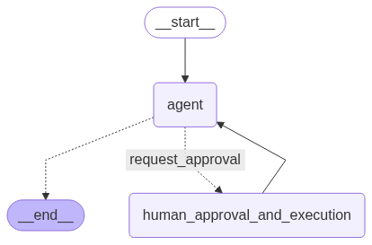
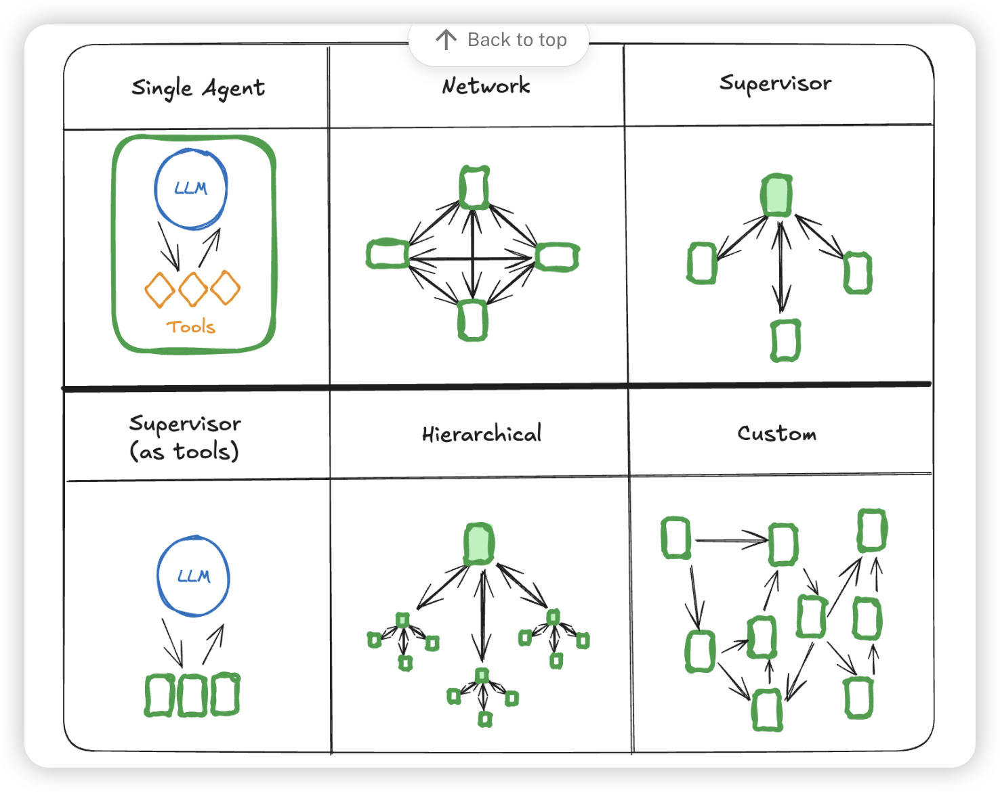
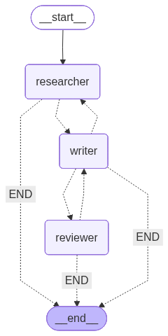

# 带你深入了解LangChain+Langgraph的学习文档笔记  (v0.3)

## 目录

- [1. 引言](#1-引言)
- [2. 什么是Langchain和Langgraph](#2-什么是langchain和langgraph)
- [3. 组件一：基础三大件 (Base)](#3-组件一基础三大件-base)
  - [3.1. 模型调用 (Language Models)](#31-模型调用-language-models)
  - [3.2. 提示模板 (Prompt Templates)](#32-提示模板-prompt-templates)
    - [基础提示词模版](#基础提示词模版)
      - [PromptTemplate](#prompttemplate)
      - [SystemMessagePromptTemplate // HumanMessagePromptTemplate // AIMessagePromptTemplate](#systemmessageprompttemplate--humanmessageprompttemplate--aimessageprompttemplate)
      - [ChatPromptTemplate](#chatprompttemplate)
    - [few-shot 模版](#few-shot-模版)
  - [3.3. 输出解析器 (Output Parsers)](#33-输出解析器-output-parsers)
    - [自定义输出解析器](#自定义输出解析器)
    - [输出修复](#输出修复)
- [4. 组件三：链 (Chains)](#4-组件三链-chains)
  - [4.1 基础概念](#41-基础概念)
    - [Runnable](#runnable)
    - [RunnableLambda](#runnablelambda)
    - [RunnableParallel (或 RunnableMap)](#runnableparallel-或-runnablemap)
    - [LangChain 表达式语言 (LCEL) - 新一代链构建方法](#langchain-表达式语言-lcel---新一代链构建方法)
  - [4.2 顺序链 (Sequential Chains)](#42-顺序链-sequential-chains)
    - [前者输出为直接作为后者输入的](#前者输出为直接作为后者输入的)
    - [前者输出作为后者的部分输入](#前者输出作为后者的部分输入)
    - [后者的输入要求不只前者的输出，还要求其他输入（例如初始信息，或者之前链的某些输出）](#后者的输入要求不只前者的输出还要求其他输入例如初始信息或者之前链的某些输出)
  - [4.3 并行链 (Parallel Chains)](#43-并行链-parallel-chains)
    - [Langchain](#langchain)
    - [Langgraph](#langgraph)
  - [4.4 循环链-Langgraph特有](#44-循环链-langgraph特有)
    - [自我修正与反思](#自我修正与反思)
- [5. 组件四：记忆 (Memory)](#5-组件四记忆-memory)
  - [5.1. 短期记忆](#51-短期记忆)
    - [添加短期记忆-节点](#添加短期记忆-节点)
    - [添加短期记忆-工具](#添加短期记忆-工具)
    - [读取记忆](#读取记忆)
    - [修剪记忆](#修剪记忆)
    - [删除记忆](#删除记忆)
    - [摘要记忆](#摘要记忆)
      - [summarize_messages](#summarize_messages)
      - [SummarizationNode](#summarizationnode)
  - [5.2 长期记忆](#52-长期记忆)
  - [5.3 检查点](#53-检查点)
    - [获取当前对话状态](#获取当前对话状态)
    - [获取整个过程对话历史状态记录](#获取整个过程对话历史状态记录)
    - [删除线程的所有检查点](#删除线程的所有检查点)
- [6. 组件五：代理 (Agents)](#6-组件五代理-agents)
  - [6.1. 工具](#61-工具)
    - [工具基本参数](#工具基本参数)
    - [创建方法](#创建方法)
      - [@tool 创建](#tool-创建)
      - [StructuredTool](#structuredtool)
      - [针对于工具的错误处理](#针对于工具的错误处理)
      - [进阶用法](#进阶用法)
    - [工具调用](#工具调用)
      - [调用方法](#调用方法)
      - [针对于隐藏参数的处理](#针对于隐藏参数的处理)
  - [6.2 React_agent](#62-react_agent)
    - [架构介绍](#架构介绍)
    - [参数介绍](#参数介绍)
  - [6.3 图](#63-图)
    - [核心概念](#核心概念)
    - [state（状态）](#state状态)
      - [常见type](#常见type)
      - [Reducers (归纳函数)](#reducers-归纳函数)
      - [Messages (消息)](#messages-消息)
      - [状态实例讲解](#状态实例讲解)
    - [Nodes (节点)](#nodes-节点)
    - [Edges (边)](#edges-边)
    - [`Send` 和 `Command`](#send-和-command)
    - [Runtime Context（运行时上下文 ）](#runtime-context运行时上下文-)
  - [6.4 多智能体](#64-多智能体)
    - [转交机制](#转交机制)
      - [意图识别](#意图识别)
      - [节点移交](#节点移交)
    - [多智能体架构](#多智能体架构)
      - [Network-网络架构（Swarm-鸟群架构）](#network-网络架构swarm-鸟群架构)
      - [Supervisor架构](#supervisor架构)


---

## 1. 引言

在ai持续飞速发展的今天，智能体开发现如今非常火爆，而作为主流的智能体开发平台 Langchain+Langgraph 也有着很高的流量

但是目前市面上的针对于该工具的视频教学过于简单，所以我书写了下面这个文档。

该文档详细记录如何集成langchain和langgraph的优势进行智能体开发，在本文档中详细记录了我使用langchain和langgraph开发智能体的经验以及结合官方文档进行的核心组件教学，在该文档中不仅涵盖了知识内容还涵盖了我对其的理解以及完整的代码实例。

文档还将会持续更新（目前更新到多智能体架构，接下来将会更新 回调机制，人机交互，时间旅行，智能体评估等）

同时我在不久我将会发布基于llamaindex进行RAG教学（包括但不限于 如何进行emmbeding微调，知识库搭建，高级rag检索，以及rag应用评估）

## 2. 什么是Langchain和Langgraph

LangChain 是一个开源框架，用于构建和扩展基于大型语言模型 (LLM) 的应用程序。它允许开发者通过“链式” (chaining) 操作来组合 LLM 与其他组件，如提示模板、内存、检索系统和工具，从而创建对话代理、自动化任务或自定义 AI 应用。LangChain 强调简单性和模块化，适合处理线性、可预测的工作流，例如问答系统或数据处理管道。

LangGraph 是 LangChain 的一个扩展模块，专注于构建状态化的、多代理工作流。它将代理逻辑建模为图 (graph)，包括节点 (nodes) 表示动作、边缘 (edges) 表示决策路径，支持循环、条件分支和复杂迭代。相比 LangChain 的高层次抽象，LangGraph 提供更低级的控制，适合处理不确定性高或需要多步推理的场景，如高级 AI 代理或动态决策系统。

总体上，LangChain 更适合初学者和简单应用，而 LangGraph 则增强了 LangChain 的能力，用于更复杂的 AI 系统构建。如果你刚入门，建议从 LangChain 开始学习，然后扩展到 LangGraph。

## 3. 组件一：基础三大件 (Base)

这是与 LLM 直接交互的层。

### 3.1. 模型调用 (Language Models)

在langchain中最常用的调用方式就是使用 ``ChatOpenai``。他是对 `openai` 库的直接封装，传入的参数，也是会直接传入给底层的 `chat.completions.create` 方法。


**以google调取思考状态为例子:**

```
from openai import OpenAI
# 这是官方给出的调用方式
client = OpenAI(
    api_key="GEMINI_API_KEY",
    base_url="https://generativelanguage.googleapis.com/v1beta/openai/"
)

response = client.chat.completions.create(
    model="gemini-2.5-flash",
    messages=[{"role": "user", "content": "Explain to me how AI works"}],
    extra_body={
      'extra_body': {
        "google": {
          "thinking_config": {
            "thinking_budget": 800,
            "include_thoughts": True
          }
        }
      }
    }
)

print(response.choices[0].message)

#### 下面是如果在langchain中设置相关参数的方式：
from langchain_openai import ChatOpenAI
import api_key

llm_google_think = ChatOpenAI(
    base_url="https://generativelanguage.googleapis.com/v1beta/openai/",
    api_key=api_key.google_api,
    model="gemini-2.5-flash",
    temperature=0.7,
    streaming=True,
    extra_body={
        'extra_body': {
            "google": {
                "thinking_config": {
                    "thinking_budget": 800,
                    "include_thoughts": True
                }
            }
        }
    }
)
# 可以看到底层的 `chat.completions.create` 方法对应的参数可以直接在 ChatOpenAI 给出。
```

### 3.2. 提示模板 (Prompt Templates)

#### 基础提示词模版
##### PromptTemplate

该提示词模版是最基本的提示词模版，所有其他模版都是在该基础的封装 一般使用方法为：

```
prompt = PromptTemplate(
    template="""请根据下面的文本，提取出人物的关键信息。
{format_instructions}
文本: {query}
""",
    input_variables=["query"],
    partial_variables={"format_instructions": format_instructions}
)
```
**SystemMessagePromptTemplate // HumanMessagePromptTemplate // AIMessagePromptTemplate**

这三个提示词模版是对 `Message` 的封装，分别对应系统消息、人类消息和AI消息。它们可以直接使用字符串或者PromptTemplate来创建。

```
1.
system_prompt=SystemMessagePromptTemplate.from_template(system_template,partial_variables={'out_put_parser': json_parser.get_format_instructions()})
2.
#或者下面这种创建方式
prompt_one=PromptTemplate.from_template(system_template,partial_variables={'out_put_parser': json_parser.get_format_instructions()})
system_prompt=SystemMessagePromptTemplate(prompt_one)#如果你已经有了prompttemplate就可以用来直接转化
3.
##同时也等价于
('system',system_template) ## 这种元组的形式 但是这样无法部分输入，适用于该提示词所有参数全部输入的场景。
```
**ChatPromptTemplate**

* `from_template` 适用于简单的字符串模板,并且他创建的是human message 一般只适用于格式化用户的输入信息。

* `from_messages` 适用于更复杂的消息格式，支持角色（如 user, assistant）和多轮对话。

**一般一个完整的提示词模版都是使用 `from_messages` 来创建的。**

```
sysytem_message = """你是一个有帮助的助手。"""
prompt = ChatPromptTemplate.from_messages(
    [
        ("system", sysytem_message),  # 系统消息也用元组定义
        ("human", "用户输入：{input}")         # 人类消息模板 如果这里输入过多 也可以预先搭建一个prompt
    ]
)
# 例如下面所示
human_prompt=ChatPromptTemplate.from_template("用户输入：{input}")
prompt= ChatPromptTemplate.from_messages(
    [
        ("system", sysytem_message),  # 系统消息也用元组定义
        human_prompt
    ]
)
```
**如果当前模块涉及到多轮对话且为ai定义了非常规角色，请务必不要使用一个 `from_template` 的模版来创建提示词。因为 `from_template` 只会创建 human message 角色信息如果处于 `human message` 会随着多轮对话容易被遗忘且很容易被用户的输入重新定义**

* 硬编码模版
```
from langchain_openai import ChatOpenAI
from langchain.prompts import ChatPromptTemplate
import api_key

llm_google = ChatOpenAI(
  base_url="https://generativelanguage.googleapis.com/v1beta/openai/",
  api_key=api_key.google_api,
  model="gemini-2.5-flash-lite",
  temperature=0.7,
  streaming=True,
)
topic = "人工智能的未来发展"
prompt_template=f"""
请你帮我写一个关于{topic}的文章：
"""
prompt=ChatPromptTemplate.from_template(prompt_template)
chain= prompt | llm_google
response = chain.invoke({})
```
* 动态提示词模版
```
topic = "人工智能的未来发展"
prompt_template="""
请你帮我写一个关于{topic}的文章：
"""
prompt=ChatPromptTemplate.from_template(prompt_template)
chain= prompt | llm_google
response = chain.invoke({'topic': topic})
```

#### few-shot 模版

**LangChain 提供了 `FewShotPromptTemplate` 来简化这个过程。** 

下面是最简单的无需对example进行处理的方法
```
examples = [
    {"input": "2 🦜 2", "output": "4"},
    {"input": "2 🦜 3", "output": "5"},
    {"input": "2 🦜 4", "output": "6"},
    {"input": "What did the cow say to the moon?", "output": "nothing at all"},
    {
        "input": "Write me a poem about the moon",
        "output": "One for the moon, and one for me, who are we to talk about the moon?",
    },
]

few_shot_prompt = FewShotChatMessagePromptTemplate(
    examples=examples,
    example_prompt=ChatPromptTemplate.from_messages(
        [('human', "{input}"), ("ai", "{output}")]
    ),
    input_variables=["input"],
)
```
**但是对于生产中由于example可能过多过杂，必须要对example进行处理所以我们通常需要引入selector。**

**下面我就直接介绍最为灵活的自定义选择器的方法，官方也封装了一些，可以自行查阅文档**
```
from langchain_core.prompts import PromptTemplate
from langchain_openai import ChatOpenAI
from langchain.prompts import ChatPromptTemplate, FewShotChatMessagePromptTemplate
from langchain_core.example_selectors.base import BaseExampleSelector
from langchain_core.messages import HumanMessage, AIMessage

# 你的示例数据
examples = [
    {"input": "2 🦜 2", "output": "4"},
    {"input": "2 🦜 3", "output": "5"},
    {"input": "2 🦜 4", "output": "6"},
    {"input": "What did the cow say to the moon?", "output": "nothing at all"},
    {
        "input": "Write me a poem about the moon",
        "output": "One for the moon, and one for me, who are we to talk about the moon?",
    },
]


# 你的自定义选择器，确保 select_examples 有返回值
class CustomExampleSelector(BaseExampleSelector):
    def __init__(self, examples):
        self.examples = examples

    def add_example(self, example):
        self.examples.append(example)

    def select_examples(self, input_variables):
        """根据输入变量选择示例。"""
        print(f"传递给选择器的输入变量: {input_variables}")

        # 这是一个简单的选择逻辑：如果输入包含鹦鹉表情，就只返回数学相关的例子
        user_input = input_variables['input']
        if "🦜" in user_input:
            return [ex for ex in self.examples if "🦜" in ex['input']]
        else:
            # 否则，返回非数学相关的例子
            return [ex for ex in self.examples if "🦜" not in ex['input']]


# 初始化选择器
example_selector = CustomExampleSelector(examples)
few_shot_prompt = FewShotChatMessagePromptTemplate(
    example_selector=example_selector,
    example_prompt=ChatPromptTemplate.from_messages(
        [('human', "{input}"), ("ai", "{output}")]
    ),
    input_variables=["input"],
)
system_prompt='你是一个有帮助的助手。'
prompt= ChatPromptTemplate.from_messages(
    [
        ("system", system_prompt),
        few_shot_prompt,
        ("human", "{input}"),
    ]
)
# --- 测试 ---
# 1. 测试数学问题
print("--- 测试数学问题 ---")
final_prompt_math = prompt.invoke({"input": "What's 3 🦜 3?"})
print(final_prompt_math.to_messages())
```
* **注意事项**
  * 如果你需要selector，那么你就无需传入examples
  * 自定义选择 其他的都可以继承，但是需要你复写 add_example 和 select_examples 方法  select_examples 方法的输入就是用户的输入，返回一个经过处理的example列表
  * input_variables 参数并不是一个过滤器，他并不会过滤掉不需要的key，他只是起到一个监控作用，即输入必须包含你要求的key，否则会报错。


### 3.3. 输出解析器 (Output Parsers)

LLM 的输出是文本，但我们常常需要结构化的数据（如 JSON, List）。输出解析器负责将模型的原始文本输出转换为我们需要的格式，并可以附带格式化指令。

* StrOutputParser
* JsonOutputParser
* CommaSeparatedListOutputParser
* PydanticOutputParser
上面四种就是最普通的，分别用来，将message转换成字符串，json，列表，pydantic，但是在实际应用中对于json或者pydantic的输出格式对于不同的场景，往往需要自定义格式，所以我们也可以使用自定义输出解析器。
#### 自定义输出解析器

```python
from base import model,llm
from langchain_openai import ChatOpenAI
from langchain.prompts import PromptTemplate
from langchain_core.output_parsers import PydanticOutputParser,StrOutputParser,JsonOutputParser,CommaSeparatedListOutputParser
from pydantic import BaseModel, Field

class CharacterInfo(BaseModel): #使用pydantic定义数据结构
    name: str = Field(description="角色的姓名")
    age: int = Field(description="角色的年龄")
    skills: list[str] = Field(description="角色的技能列表")

# 2. 创建解析器
parser = PydanticOutputParser(pydantic_object=CharacterInfo)
parser = JsonOutputParser(pydantic_object=CharacterInfo) ##这是json自定义

# 3. 获取格式化指令
format_instructions = parser.get_format_instructions()


# 5. 在你的中文提示中使用它
prompt = PromptTemplate(
    template="""请根据下面的文本，提取出人物的关键信息。

{format_instructions}

文本: {query}
""",
    input_variables=["query"],
    partial_variables={"format_instructions": format_instructions} #部分追加，预先加入一些无需动态填入的参数，这样减少了之后invoke时的参数
)

# 6. 运行链
chain = prompt | llm | parser
answer = chain.invoke({
    "query": "角色名是亚瑟，年龄30岁，技能包括剑术、骑术和战略。"
})
### 输出 name='亚瑟' age=30 skills=['剑术', '骑术', '战略']
### {'name': '亚瑟', 'age': 30, 'skills': ['剑术', '骑术', '战略']}

```
**注意事项：**
* 针对于json和pydantic流式输出问题：
  * 他们的流式输出每次流式返回的都是对应类型（以json为例子）
```
{'name': '李雷', 'age': 120}
{'name': '李雷', 'age': 120, 'skills': ['']}
{'name': '李雷', 'age': 120, 'skills': ['火焰']}
{'name': '李雷', 'age': 120, 'skills': ['火焰魔法']}
{'name': '李雷', 'age': 120, 'skills': ['火焰魔法', '']}
{'name': '李雷', 'age': 120, 'skills': ['火焰魔法', '空间']}
{'name': '李雷', 'age': 120, 'skills': ['火焰魔法', '空间传送']}
```
  但是我们如果与前端流式交互的话就需要我们进行处理,下面的操作就可以保证某一个key的value在输出的时候是真正的流式输出了。
```
for chunk in chain.stream({"query": query_text}):
    if hasattr(chunk, "name"):
        print(chunk.name.replace(last_name, ""))
        last_name=chunk.name
```
#### 输出修复
llm有时候会因为各种原因导致输出错误，所以我们需要进行检查，这里我给出最常用的方法
```python
from langchain.output_parsers import RetryOutputParser
from base import model,llm
from langchain.prompts import PromptTemplate,ChatPromptTemplate
from langchain_core.output_parsers import PydanticOutputParser,StrOutputParser,JsonOutputParser,CommaSeparatedListOutputParser
from pydantic import BaseModel, Field
class CharacterInfo(BaseModel):
    name: str = Field(description="角色的姓名")
    age: int = Field(description="角色的年龄")
    skills: list[str] = Field(description="角色的技能列表")

parser = PydanticOutputParser(pydantic_object=CharacterInfo)

format_instructions = parser.get_format_instructions()

prompt = PromptTemplate(
    template="""请根据下面的文本，提取出人物的关键信息。
{format_instructions}
文本: {query}
""",
    input_variables=["query"],
    partial_variables={"format_instructions": format_instructions}
)
prompt_value = prompt.format_prompt(query="角色的姓名是张三，年龄是二十五岁，技能包括编程、绘画和写作。") ##转为promptvalue对象

retry_parser = RetryOutputParser.from_llm(parser=parser, llm=llm) ## 创建实例，需要传入 原始解释器和 LLM
bad_response = "角色的姓名是张三，年龄是二十五岁，技能包括编程、绘画和写作。" ### 假设这是模型第一次错误的输出
result=retry_parser.parse_with_prompt(bad_response, prompt_value) ## 使用parse_with_prompt方法来解析响应，需要传入输出和一个promptvalue 对象

## name='张三' age=25 skills=['编程', '绘画', '写作']
```
**特别注意调用方法的时候需要传入的是PromptValue 对象，而不是直接传入字符串或者template。**  

## 4. 组件三：链 (Chains)

链是将多个组件（如模型、提示、检索器）按顺序组合起来的核心
### 4.1 基础概念
#### Runnable
Runnable 是 LangChain 表达式语言 (LCEL) 的基石。它是一个标准化的接口，任何实现了该接口的对象都可以被无缝地集成到 LCEL 链式调用中。可以把它理解为 LCEL 世界里的“通用零件”或“标准插头”。
一个对象一旦成为 Runnable，就自动获得了 LCEL 提供的所有能力

#### RunnableLambda
RunnableLambda 是一个“适配器”或“包装器”，它可以将任何普通的 Python 函数或 lambda 表达式转换成一个标准的 Runnable 对象。这为你打开了一扇大门，让你可以在 LCEL 链中执行任意的自定义逻辑。

#### RunnableParallel (或 RunnableMap)

RunnableParallel（通常通过字典字面量隐式创建，所以也常被称为 RunnableMap）是一个特殊的 Runnable，它允许你并行执行多个 Runnable，并将它们的结果聚合到一个字典中。
它的主要作用是 **“扇出/扇入”（Fan-out/Fan-in）**：将一个输入同时分发给多个处理分支（扇出），然后将每个分支的结果收集到一个新的字典里（扇入）。
```
parallel_chain = {
    "original_topic": lambda x: x["topic"], # 提取原始 topic
    "generated_fact": chain_a,             # 执行 chain_a
    "passthrough_input": RunnablePassthrough() # 传递整个原始输入
}
```

他可以传入runnable对象或者普通函数，普通函数会在内部被自动转换为 RunnableLambda 对象。


#### LangChain 表达式语言 (LCEL) - 新一代链构建方法

LCEL 是目前构建链的**首选方式**。它使用管道符 `|` 来连接组件，语法更简洁，并且原生支持流式处理、批处理和异步调用。

**代码实例 (LCEL):**

```python
from langchain_core.prompts import ChatPromptTemplate
from langchain_openai import ChatOpenAI
from langchain_core.output_parsers import StrOutputParser

# 1. 定义提示、模型和输出解析器
prompt = ChatPromptTemplate.from_template("写一个关于 {topic} 的短笑话。")
model = ChatOpenAI()
output_parser = StrOutputParser()

# 2. 使用 LCEL 管道符 | 组合成链
chain = prompt | model | output_parser

# 3. 调用链
response = chain.invoke({"topic": "程序员"})
print(response)
# 输出: 为什么程序员总是把万圣节和圣诞节搞混？因为 OCT 31 == DEC 25！
```

### 4.2 顺序链 (Sequential Chains)

将多个链按顺序连接起来，前一个链的输出作为后一个链的输入。

#### 前者输出为直接作为后者输入的

```python
from langchain_core.prompts import ChatPromptTemplate
from langchain_openai import ChatOpenAI
from langchain_core.output_parsers import StrOutputParser

# 链1: 根据主题生成一个剧本标题
prompt1 = ChatPromptTemplate.from_template("给我一个关于 {topic} 的奇幻剧本标题。")
model = ChatOpenAI()
chain1 = prompt1 | model | StrOutputParser()

# 链2: 根据剧本标题写一个简介
prompt2 = ChatPromptTemplate.from_template("为剧本《{title}》写一个20字的简介。")
chain2 = prompt2 | model | StrOutputParser()

# 组合成顺序链 直接连接即可
sequential_chain = chain1 | chain2

response = sequential_chain.invoke({"topic": "时间旅行的猫"})
print(response)
# 输出: 一只古埃及的猫意外穿越到未来，必须在科技都市中找到回家的路。
```
#### 前者输出作为后者的部分输入
我们可以使用自定义函数来调控这一行为。
```python
import os
from langchain_openai import ChatOpenAI
from langchain_core.prompts import ChatPromptTemplate
from langchain_core.output_parsers import JsonOutputParser, StrOutputParser
from langchain_core.runnables import RunnableLambda,RunnableSequence, RunnableParallel,RunnablePassthrough
from base import  llm

# --- 链 A: 信息生成器 ---
# 提示词，要求 LLM 输出 JSON
prompt_a = ChatPromptTemplate.from_template(
    "请为主题 '{topic}' 提供一个有趣的事实和一个相关的活动。以 JSON 格式返回，包含 'fact' 和 'activity' 键。"
)
# 链 A = 提示词 | LLM | JSON解析器
chain_a = prompt_a | llm | JsonOutputParser()

# --- 链 B: 翻译器 ---
# 提示词，接收 'text_to_translate' 变量
prompt_b = ChatPromptTemplate.from_template(
    "请将以下文本翻译成英文：\n{text_to_translate}"
)

chain_b = prompt_b | llm | StrOutputParser()


full_chain = chain_a | RunnableLambda(lambda x: chain_b.invoke(x['fact'])) 
# --- 运行完整的链 ---
topic_to_analyze = "咖啡"
print(f"开始处理主题: {topic_to_analyze}\n")
final_result = full_chain.invoke({"topic": topic_to_analyze})
print("\n=====================")
print("最终的翻译结果:")
print(final_result)

#
```

输出
```

开始处理主题: 咖啡

=====================
最终的翻译结果:
Coffee is the second most traded commodity in the world, after oil.
```

同时我们还可以采用RunnableMap来处理这一行为
```python
import os
from langchain_openai import ChatOpenAI
from langchain_core.prompts import ChatPromptTemplate
from langchain_core.output_parsers import JsonOutputParser, StrOutputParser
from langchain_core.runnables import RunnableLambda
from base import  llm

# --- 链 A: 信息生成器 ---
# 提示词，要求 LLM 输出 JSON
prompt_a = ChatPromptTemplate.from_template(
    "请为主题 '{topic}' 提供一个有趣的事实和一个相关的活动。以 JSON 格式返回，包含 'fact' 和 'activity' 键。"
)
# 链 A = 提示词 | LLM | JSON解析器
chain_a = prompt_a | llm | JsonOutputParser()

# --- 链 B: 翻译器 ---
# 提示词，接收 'text_to_translate' 变量
prompt_b = ChatPromptTemplate.from_template(
    "请将以下文本翻译成英文：\n{text_to_translate}"
)
chain_b = prompt_b | llm | StrOutputParser()
chain_c={'out_put': lambda x :chain_b.invoke(x['fact'])}
full_chain = chain_a | chain_c
# --- 运行完整的链 ---
topic_to_analyze = "咖啡"
print(f"开始处理主题: {topic_to_analyze}\n")
final_result = full_chain.invoke({"topic": topic_to_analyze})

```
输出
```
开始处理主题: 咖啡
=====================
最终的翻译结果:
{'out_put': 'Coffee is the second most traded commodity in the world, after petroleum.  \n\n(Note: The translation uses "petroleum" as it is the more precise term for crude oil in commodity trading contexts, though "oil" could also be used colloquially. The structure mirrors the original\'s emphasis on ranking while maintaining clarity.)'}

```

可以看到前者是直接返回的输出内容，而后者返回一个字典


#### 后者的输入要求不只前者的输出，还要求其他输入（例如初始信息，或者之前链的某些输出）

**实例代码-Langchain**

```python
import os
from langchain_openai import ChatOpenAI
from langchain_core.prompts import ChatPromptTemplate
from langchain_core.output_parsers import JsonOutputParser, StrOutputParser
from langchain_core.runnables import RunnableLambda, RunnablePassthrough
from base import llm

# --- 链 A: 目的地分析器 ---
prompt_a = ChatPromptTemplate.from_template(
    "去城市 '{city}' 旅游的最佳季节是什么？以 JSON 格式返回，只包含 'best_season' 键。"
)
chain_a = prompt_a | llm | JsonOutputParser()

# --- 链 B: 活动生成器 ---
prompt_b = ChatPromptTemplate.from_template(
    "在 '{season}' 的 '{city}'，推荐一项特色活动。以 JSON 格式返回，只包含 'activity' 键。"
)
chain_b = prompt_b | llm | JsonOutputParser()

# --- 链 C: 行程总结器 ---
prompt_c = ChatPromptTemplate.from_template(
    "为我制定一份去 '{original_city}' 的简短旅行建议。\n"
    "最佳季节是: {travel_season}\n"
    "推荐活动是: {recommended_activity}"
)
chain_c = prompt_c | llm | StrOutputParser()


# --- 组装完整的顺序链 (最关键的部分) ---

# 第一步：执行链 A，并保留原始输入
chain_step1 = {
    "original_input": RunnablePassthrough(), # 携带 {"city": "..."}
    "chain_a_output": chain_a,             # 执行链 A
}

# 第二步：准备链 B 的输入，并执行链 B，同时保留第一步的所有信息
chain_step2 = {
    # 再次使用 RunnablePassthrough，这次它携带的是 chain_step1 的完整输出
    "previous_info": RunnablePassthrough(),
    # 从上一步的结果中提取数据来调用 chain_b
    "chain_b_output": lambda x: chain_b.invoke({
        "city": x["original_input"]["city"],
        "season": x["chain_a_output"]["best_season"]
    })
}

# 第三步：最终的数据整理和调用链 C
full_chain = (
    chain_step1
    | chain_step2
    | RunnableLambda(
        # 这个 lambda 的输入是 chain_step2 的输出，一个包含了所有历史信息的嵌套字典
        # x 的结构: {'previous_info': {'original_input': ..., 'chain_a_output': ...}, 'chain_b_output': ...}
        lambda x: {
            "original_city": x["previous_info"]["original_input"]["city"],
            "travel_season": x["previous_info"]["chain_a_output"]["best_season"],
            "recommended_activity": x["chain_b_output"]["activity"],
        }
    )
    | chain_c
)


# --- 运行完整的链 ---
city_to_plan = "京都"
print(f"开始为城市 '{city_to_plan}' 制定旅行计划...\n")

final_result = full_chain.invoke({"city": city_to_plan})

print("\n=====================")
print("最终的旅行建议:")
print(final_result)
```
在这部分代码中数据的传递采用的是`RunnablePassthrough` 这个函数的作用就是将当前的输入作为输出传递给下一个链。这样可以确保在每个步骤中都能访问到之前的所有信息。

代码实例-Langgraph

```python
import os
from typing import TypedDict

# 从 langgraph 库导入核心组件
from langgraph.graph import StateGraph, END

# 从 langchain 库导入所需组件
from langchain_openai import ChatOpenAI
from langchain_core.prompts import ChatPromptTemplate
from langchain_core.output_parsers import JsonOutputParser, StrOutputParser
from base import llm


# --- 2. 定义图的状态 (State) ---
# 这是 LangGraph 的核心。我们定义一个中心化的“状态”对象，
# 它将像一个共享的白板一样，在图的各个节点之间传递和更新。

class TravelPlanState(TypedDict):
    """
    定义图的状态，它将包含所有需要的信息。

    Attributes:
        city: 初始输入的城市名称。
        best_season: 由节点A生成的最佳季节。
        activity: 由节点B生成的推荐活动。
        final_plan: 由节点C生成的最终旅行建议。
    """
    city: str
    best_season: str
    activity: str
    final_plan: str


# --- 3. 将原有的链包装成图的节点 (Nodes) ---
# 每个独立的逻辑单元都将被封装成一个图的节点。
# 每个节点都是一个函数，它接收当前的状态，执行其任务，
# 然后返回一个包含要更新的状态字段的字典。

def analyze_destination(state: TravelPlanState):
    """节点 A: 目的地分析器，负责填充 'best_season' 字段。"""
    print("--- 正在执行节点: 目的地分析器 ---")
    prompt_a = ChatPromptTemplate.from_template(
        "去城市 '{city}' 旅游的最佳季节是什么？以 JSON 格式返回，只包含 'best_season' 键。"
    )
    chain_a = prompt_a | llm | JsonOutputParser()

    city = state["city"]
    result = chain_a.invoke({"city": city})

    # 返回一个字典，指明要更新状态中的哪个字段
    return {"best_season": result["best_season"]}


def generate_activity(state: TravelPlanState):
    """节点 B: 活动生成器，负责填充 'activity' 字段。"""
    print("--- 正在执行节点: 活动生成器 ---")
    prompt_b = ChatPromptTemplate.from_template(
        "在 '{season}' 的 '{city}'，推荐一项特色活动。以 JSON 格式返回，只包含 'activity' 键。"
    )
    chain_b = prompt_b | llm | JsonOutputParser()

    city = state["city"]
    season = state["best_season"]  # 直接从状态中读取上一步的结果
    result = chain_b.invoke({"city": city, "season": season})

    return {"activity": result["activity"]}


def summarize_plan(state: TravelPlanState):
    """节点 C: 行程总结器，负责填充 'final_plan' 字段。"""
    print("--- 正在执行节点: 行程总结器 ---")
    prompt_c = ChatPromptTemplate.from_template(
        "为我制定一份去 '{original_city}' 的简短旅行建议。\n"
        "最佳季节是: {travel_season}\n"
        "推荐活动是: {recommended_activity}"
    )
    chain_c = prompt_c | llm | StrOutputParser()

    # 直接从状态中读取所有需要的信息，无需复杂的传递
    result = chain_c.invoke({
        "original_city": state["city"],
        "travel_season": state["best_season"],
        "recommended_activity": state["activity"]
    })

    return {"final_plan": result}


# --- 4. 构建图 (Graph) ---
# 现在，我们将定义好的状态和节点组装成一个工作流图。

# 4.1 初始化一个状态图，并告诉它我们的状态结构
workflow = StateGraph(TravelPlanState)

# 4.2 将我们定义的函数添加为图中的节点
workflow.add_node("analyzer", analyze_destination)
workflow.add_node("activity_generator", generate_activity)
workflow.add_node("summarizer", summarize_plan)

# 4.3 定义节点之间的连接关系（边），这决定了执行的顺序
workflow.set_entry_point("analyzer")  # 设置入口节点
workflow.add_edge("analyzer", "activity_generator")
workflow.add_edge("activity_generator", "summarizer")
workflow.add_edge("summarizer", END)  # 'summarizer' 是最后一个节点，执行完后结束

# 4.4 编译图，生成一个可执行的应用
app = workflow.compile()

# --- 5. 运行 LangGraph 应用 ---

if __name__ == "__main__":
    city_to_plan = "京都"
    print(f"开始为城市 '{city_to_plan}' 制定旅行计划...\n")

    # 初始输入只需要提供状态中第一个节点需要的字段
    initial_state = {"city": city_to_plan}

    # 调用图，它会从入口节点开始，按照我们定义的边顺序执行
    # .invoke() 会返回最终的状态对象
    final_state = app.invoke(initial_state)

    print("\n=====================")
    print("最终的旅行建议:")
    # 最终的结果存储在返回的状态对象的 'final_plan' 字段中
    print(final_state.get("final_plan", "未能生成计划。"))

    # 你也可以打印整个最终状态，看看所有字段是如何被填充的
    print("\n--- 最终状态对象 ---")
    print(final_state)
```
**其实可以看到涉及到后续chain需要使用前面数据的这种顺序链连接完全使用langchain连接是复杂的，尤其涉及到每次的输入信息都可能在后面被用到的情况**

**所以这时候我们就可以采用Langgraph进行构建，Langchain可以封装一些简单的顺序链再结合Langgraph会十分顺畅**


### 4.3 并行链 (Parallel Chains)
#### Langchain
在langchain中实行并行之前已经讲过就是 `RunnableParallel` 他会并行执行多个 Runnable，并将结果聚合到一个字典中。我就不在重点介绍了。

#### Langgraph

在langgraph中所有的链其实都是通过节点连接起来的

```python
import os
from typing import TypedDict, List, Optional
from langchain_openai import ChatOpenAI
from langchain_core.prompts import ChatPromptTemplate
from langchain_core.output_parsers import StrOutputParser
from langgraph.graph import StateGraph, END
from base import llm


# --- 1. 定义状态 (State) ---
# 状态是图在执行过程中传递的数据结构。
# 每个节点都会接收当前状态，并可以返回一个更新后的状态。
class GraphState(TypedDict):
    original_question: str  # 用户的原始问题
    summary: Optional[str]  # 总结节点的结果
    keywords: Optional[str] # 关键词节点的结果
    translation: Optional[str] # 翻译节点的结果
    final_result: Optional[str] # 聚合节点的最终结果


# 总结链
summarizer_prompt = ChatPromptTemplate.from_template("请用一句话总结以下文本：\n\n{text}")
summarizer_chain = summarizer_prompt | llm | StrOutputParser()

# 关键词链
keywords_prompt = ChatPromptTemplate.from_template("请从以下文本中提取3个核心关键词，用逗号分隔：\n\n{text}")
keywords_chain = keywords_prompt | llm | StrOutputParser()

# 翻译链
translator_prompt = ChatPromptTemplate.from_template("请将以下文本翻译成英文：\n\n{text}")
translator_chain = translator_prompt | llm | StrOutputParser()


# --- 3. 定义图的节点 (Nodes) ---
# 每个节点都是一个函数，接收 state 作为输入，返回一个包含状态更新的字典。

def start_node(state: GraphState):
    """
    起始节点，打印一条消息表示工作流开始。
    它不修改状态，只是作为流程的入口。
    """
    print("--- 工作流开始 ---")
    # 原始问题已经通过 .invoke() 的输入传入了 state
    return {}

def summarize_node(state: GraphState):
    """
    总结节点：调用总结链并更新状态。
    """
    print("...正在执行总结任务...")
    question = state["original_question"]
    summary_result = summarizer_chain.invoke({"text": question})
    return {"summary": summary_result}

def keywords_node(state: GraphState):
    """
    关键词节点：调用关键词链并更新状态。
    """
    print("...正在执行提取关键词任务...")
    question = state["original_question"]
    keywords_result = keywords_chain.invoke({"text": question})
    return {"keywords": keywords_result}

def translate_node(state: GraphState):
    """
    翻译节点：调用翻译链并更新状态。
    """
    print("...正在执行翻译任务...")
    question = state["original_question"]
    translation_result = translator_chain.invoke({"text": question})
    return {"translation": translation_result}

def aggregator_node(state: GraphState):
    """
    聚合节点：等待所有并行分支完成后，汇总结果。
    """
    print("--- 正在聚合所有结果 ---")
    summary = state.get("summary", "无总结")
    keywords = state.get("keywords", "无关键词")
    translation = state.get("translation", "无翻译")

    final_report = f"""
## 并行任务处理报告

**原始文本**: {state['original_question']}

---

### 1. 文本摘要
{summary}

---

### 2. 核心关键词
{keywords}

---

### 3. 英文翻译
{translation}
"""
    return {"final_result": final_report}


# --- 4. 构建图 (Graph) ---
workflow = StateGraph(GraphState)

# 添加所有节点
workflow.add_node("start", start_node)
workflow.add_node("summarize", summarize_node)
workflow.add_node("keywords", keywords_node)
workflow.add_node("translate", translate_node)
workflow.add_node("aggregator", aggregator_node)

# 设置入口点
workflow.set_entry_point("start")

# 添加边
# **关键点**: 从 'start' 节点到三个并行节点的边。
# 将边的目标设置为一个列表，LangGraph 会自动并行执行列表中的所有节点。
for node in ["summarize", "keywords", "translate"]:
    workflow.add_edge("start", node)
    workflow.add_edge(node, "aggregator")


# 将聚合节点连接到终点
workflow.add_edge("aggregator", END)

# 编译图
app = workflow.compile()

```
这是整个图结构


虽然上述两种方法都实现了链的并行，但是各自优缺点明显
* langchain结构简单，方便构建，只需要构建一个字典传入一个runnable对象或者可调用函数即可。
* langgraph虽然构建麻烦，但是由于各个并行函数是以节点的形式存在的，他可以更新状态，并且通过stream流可以获取各个并行函数的结果。

* **总结：** 如果你的并行任务简单且不需要与外部进行交互（例如前后端交互）那么langchain无疑更好，但是如果涉及到需要将并行节点的输出内容进行向下传输那么langgraph更好
* 当然在实际应用中我们需要组合使用这两种方法来进行构建。
### 4.4 循环链-Langgraph特有 
循环链链主要的作用在于
* 自我修正与反思（例如工具调用，或者决策）
* 人机交互的多轮对话
#### 自我修正与反思
我以对工具调用进行权限申请的逻辑为例，来说明循环链的使用。
```python
import os
from operator import add
from typing import TypedDict, List, Annotated
from langchain_core.messages import BaseMessage, HumanMessage, AIMessage, ToolMessage,SystemMessage
from langgraph.graph import StateGraph, END

from langchain_core.tools import tool
from base import llm

# --- 1. 定义工具 (Tools) ---
# 我们定义两个工具：一个用于网络搜索，一个用于计算。

# 工具1：网络搜索
@tool
def search_tool(query: str) -> str:
    """使用 搜索工具进行网络搜索。"""
    print(f"--- 正在执行搜索工具: {query} ---")
    return '天气晴朗'
#为了方便我模拟了一个网络搜索

# 工具2：一个简单的乘法计算器
@tool
def multiply(a: int, b: int) -> int:
    """计算两个整数的乘积。"""
    print(f"--- 正在执行乘法工具: {a} * {b} ---")
    return a * b


# 将所有工具放入一个列表
tools = [search_tool, multiply]
tools_name={k.name:k for k in tools}
print(tools_name)
# --- 2. 定义状态 (State) ---
# 状态需要包含对话历史和任何中间结果。
class AgentState(TypedDict):
    messages: Annotated[List[BaseMessage],add]
    # 我们增加一个字段来跟踪被拒绝的工具调用，以便Agent可以知道
    rejected_tool_calls: List[dict]


# --- 3. 定义图的节点 (Nodes) ---

# 节点1: Agent 节点 (调用LLM进行思考)
# 我们将LLM和工具绑定，使其能够生成 tool_calls

llm_with_tools = llm.bind_tools(tools)

def agent_node(state: AgentState):
    """
    Agent节点：根据当前对话历史进行思考，决定下一步行动。
    """
    print("--- Agent 正在思考... ---")
    response = llm_with_tools.invoke(state["messages"])
    # Agent的响应是一个AIMessage，它会被自动添加到状态的messages列表中
    return {"messages": [response]} #因为我在state中设置的message是以add形式的所以更新策略是追加而非覆盖，所以我可以直接返回当前信息，不用copy一遍追加再返回
def human_approval_node(state: AgentState) -> dict:
    """
    检查最新的AI消息是否包含工具调用请求。
    如果是，则请求人工批准，并根据批准结果执行或生成拒绝消息。
    返回一个包含所有结果的 ToolMessage 列表。
    """
    print("--- 等待人工审批 ---")
    last_message = state["messages"][-1]
    # 确保最后一条消息是带有工具调用的AI消息
    if not isinstance(last_message, AIMessage) or not last_message.tool_calls:
        return {}

    tool_messages = []
    tool_dict = {tool.name: tool for tool in tools}

    for tool_call in last_message.tool_calls:##如果存在工具请求那么返回的这一组信息就会存在tool.calls(可能存在多个工具调用，所以要用循环)
        tool_name = tool_call['name']#获取当前调用工具的名字
        tool_args = tool_call['args']#获取当前调用工具的参数
        tool_to_run = tool_dict.get(tool_name)#获取工具对象

        prompt = f"Agent 想要执行工具 '{tool_name}' (参数: {tool_args})。\n你是否批准？ (yes/no): "
        user_input = input(prompt).lower() ##我现在在模拟权限申请，真正的前后端交互时是需要用interrupt的（后面会讲到）

        if user_input == 'yes' and tool_to_run:
            print(f"✅ 已批准并执行: {tool_name}")
            try:
                # 直接在这里执行工具
                result = tool_to_run.invoke(tool_args)
                tool_messages.append(
                    ToolMessage(
                        content=str(result), # 确保内容是字符串
                        name=tool_name,
                        tool_call_id=tool_call["id"]
                    )
                )
            except Exception as e:
                print(f"工具 '{tool_name}' 执行出错: {e}")
                tool_messages.append(
                    ToolMessage(
                        content=f"Error executing tool: {e}",
                        name=tool_name,
                        tool_call_id=tool_call["id"]
                    )
                )
        else:
            print(f"❌ 已拒绝执行: {tool_name}")
            # 为被拒绝的工具创建一个明确的 ToolMessage
            rejected_content = f"User denied permission to run tool '{tool_name}'."
            tool_messages.append(
                ToolMessage(
                    content=rejected_content,
                    name=tool_name,
                    tool_call_id=tool_call["id"]
                )
            )
    # 返回的ToolMessage列表会被自动添加到状态的messages列表中
    return {"messages": tool_messages}

# --- 4. 定义条件边/路由器 (Router) ---
def router(state: AgentState):
    """
    决策节点：在Agent思考后，决定流程走向。
    """
    print("--- 正在决策... ---")
    last_message = state["messages"][-1]
    if isinstance(last_message, AIMessage) and last_message.tool_calls:
        # 如果有工具调用请求，则进入人工审批环节
        print("决策结果: 需要人工审批。")
        return "request_approval"
    else:
        # 如果没有工具调用（意味着Agent准备直接回答），则结束流程
        print("决策结果: 无需工具，流程结束。")
        return END
    ##在这我解释一下为什么没有工具调用就代表着输出完成，因为只有当有工具调用的时候会打断模型输出，所以当没有工具调用，但仍然节点跳转了就只能是输出真正结束了

# --- 5. 构建图 (Graph) ---
workflow = StateGraph(AgentState)

# 添加节点
workflow.add_node("agent", agent_node)
workflow.add_node("human_approval_and_execution", human_approval_node)

# 设置入口点
workflow.set_entry_point("agent")

# 添加条件边
workflow.add_conditional_edges(
    "agent",
    router,
    {
        "request_approval": "human_approval_and_execution",
        END: END
    }
)

# 添加常规边，形成循环
# 审批和执行后 -> 返回Agent，让它看到所有工具的结果（包括被拒绝的）
workflow.add_edge("human_approval_and_execution", "agent")

# 编译图
app = workflow.compile()

# --- 6. 运行和交互 ---
config = {"recursion_limit": 100}
initial_messages = [HumanMessage(content="今天北京的天气怎么样？然后计算一下 25 乘以 8 的结果。")]
thread = {"messages": initial_messages}

print("="*50)
print(f"用户问题: {initial_messages[0].content}")
print("="*50)

for event in app.stream(thread, config=config):
    for key, value in event.items():
        print(f"--- 节点 '{key}' 的输出 ---")
        if "messages" in value:
            latest_messages = value["messages"]
            for msg in latest_messages:
                if isinstance(msg, AIMessage) and msg.content:
                     print(f"AI 回答: {msg.content}")
                # 可以在这里添加对其他消息类型的打印，用于调试
                # print(f"  - {msg.pretty_repr()}")
        print("-" * 20)

```
```
{'search_tool': StructuredTool(name='search_tool', description='使用 搜索工具进行网络搜索。', args_schema=<class 'langchain_core.utils.pydantic.search_tool'>, func=<function search_tool at 0x111c60430>), 'multiply': StructuredTool(name='multiply', description='计算两个整数的乘积。', args_schema=<class 'langchain_core.utils.pydantic.multiply'>, func=<function multiply at 0x158b039a0>)}
==================================================
用户问题: 今天北京的天气怎么样？然后计算一下 25 乘以 8 的结果。
==================================================
--- Agent 正在思考... ---
--- 正在决策... ---
决策结果: 需要人工审批。
--- 节点 'agent' 的输出 ---
--------------------
--- 等待人工审批 ---
Agent 想要执行工具 'search_tool' (参数: {'query': '今天北京的天气'})。
你是否批准？ (yes/no): no
❌ 已拒绝执行: search_tool
Agent 想要执行工具 'multiply' (参数: {'a': 25, 'b': 8})。
你是否批准？ (yes/no): yes
✅ 已批准并执行: multiply
--- 正在执行乘法工具: 25 * 8 ---
--- 节点 'human_approval_and_execution' 的输出 ---
--------------------
--- Agent 正在思考... ---
--- 正在决策... ---
决策结果: 无需工具，流程结束。
--- 节点 'agent' 的输出 ---
AI 回答: 今天北京的天气信息无法获取，因为搜索权限被拒绝了。  

25 乘以 8 的结果是 200。
--------------------
```
这是该循环链的工作流图

当agent节点结束后会进入条件边判断流转，如果是工具调用进入human_approval_node节点，然后执行完成之后就会返回到agent节点，agent节点就会利用最新更新的message再次跑一遍llm直到输出结束

在human_approval_node中你可以实现各种你想要的功能例如打印调试信息或者对工具输出结果的评估等等，这种循环链的设计使得 Agent 能够在每次工具调用后进行反思和决策，确保最终输出的质量。

其实langgraph中的react_agent也是通过循环链实现的，他的核心就是让agent不断的思考和决策，直到输出最终结果,其中就是通过message来回溯之前处理的内容的（后面会更加深入的讲解）


## 5. 组件四：记忆 (Memory)

为了让对话能够持续，链和 Agent 需要记住之前的交互。在`langchain` v0.3版本之后，官方更加推荐使用`langgraph`进行记忆管理，所以下面我将使用`langgraph`进行讲解

### 5.1. 短期记忆

在langgraph中短期记忆已经作为状态中的一部分，下面我将介绍针对于短期记忆的一些处理方式

#### 添加短期记忆-节点

**代码实例:**

```python
from typing import Annotated, Sequence
from typing_extensions import TypedDict
from langgraph.checkpoint.memory import InMemorySaver
from langgraph.graph import StateGraph, START, END
from langgraph.graph.message import add_messages
from langchain_core.prompts import ChatPromptTemplate, MessagesPlaceholder
from langchain_core.messages import BaseMessage, HumanMessage, AIMessage
from base import model
# 定义状态，包含消息历史（短期记忆）
class AgentState(TypedDict):
    messages: Annotated[Sequence[BaseMessage], add_messages]

# 定义代理节点，处理输入并使用短期记忆
def agent_node(state: AgentState) -> AgentState:
    prompt = ChatPromptTemplate.from_messages([
        ("system", "你是一个友好的助手。请根据对话历史自然回应。"),
        MessagesPlaceholder(variable_name="messages"),  # 注入短期记忆
    ])
    chain = prompt | model  # 使用预定义的模型
    response = chain.invoke(state["messages"])
    return {"messages": [response]}

# 初始化检查点存储（短期记忆持久化）
checkpointer = InMemorySaver()

# 构建状态图
builder = StateGraph(state_schema=AgentState)
builder.add_node("agent", agent_node)
builder.add_edge(START, "agent")
builder.add_edge("agent", END)

# 编译图形，启用检查点
graph = builder.compile(checkpointer=checkpointer)

# 测试多轮交互，展示短期记忆
def run_conversation():
    # 第一轮：用户自我介绍
    inputs = {"messages": [HumanMessage(content="你好！我是Bob")]}
    config = {"configurable": {"thread_id": "1"}}  # thread_id确保记忆隔离
    result = graph.invoke(inputs, config)
    print('问题',inputs['messages'][0].content)
    print("助手：", result["messages"][-1].content)

    # 第二轮：验证是否记住Bob
    inputs = {"messages": [HumanMessage(content="我的名字是什么？")]}
    result = graph.invoke(inputs, config)
    print('问题', inputs['messages'][0].content)
    print("助手：", result["messages"][-1].content)


# 执行测试
if __name__ == "__main__":
    run_conversation()
```

```
运行结果：

问题 你好！我是Bob
助手： 你好，Bob！很高兴见到你。有什么我可以帮你的吗？

问题 我的名字是什么？
助手： 你的名字是Bob。很高兴认识你，Bob！
```

可以看到记忆被成功添加到了llm中，但是注意在langgraph中记忆是存在隔离的，只有config中的线程一致才会调用相关记忆

#### 添加短期记忆-工具

在节点中添加短期记忆可以直接通过return的方式，那么消息就会被添加进入状态，但是工具输出的返回值不会用于更新状态，如果你想要工具的输出在状态中更新可以使用下面这个方法

```python

@tool(description='查询用户姓名的工具')
def update_user_info(
        tool_call_id: Annotated[str, InjectedToolCallId],
        config: RunnableConfig
) -> Command:
    """查找并更新用户信息。
    Args:
        tool_call_id: 工具调用ID
        config: 运行配置，包含用户ID
    Returns:
        Command对象，包含更新后的用户名和消息历史
    """
    user_id = config["configurable"].get("user_id")
    print(user_id)
    name = "张伟" if user_id == "user_123" else "未知用户"
    return Command(update={
        "user_name": name,
        # 更新消息历史
        "messages": [
            ToolMessage(
                "成功查找用户信息",
                tool_call_id=tool_call_id
            )
        ]
    })

```

你可以使用command的方式进行路由来进行状态更新，此时工具的返回值用于状态更新

#### 读取记忆

读取记忆就非常简单，直接传入相关状态然后进行读取即可

#### 修剪记忆

```python
from base import llm as model
from typing import Annotated, Sequence
from langchain_core.tools import tool
from langchain_core.messages import HumanMessage, ToolMessage, AIMessage
from langchain_core.messages.utils import trim_messages, count_tokens_approximately
from langchain_core.runnables import RunnableConfig
from langgraph.prebuilt import create_react_agent
from langgraph.checkpoint.memory import InMemorySaver
from langgraph.prebuilt.chat_agent_executor import AgentState
import json

# 模拟日程数据库
schedule_db = {
    "2025-10-13": ["上午9点：团队会议"]
}

# 定义工具
@tool
def get_schedule(date: str) -> str:
    """查询指定日期的日程安排。
    Args:
        date: 日期，格式为YYYY-MM-DD
    Returns:
        日程列表的JSON字符串
    """
    return json.dumps(schedule_db.get(date, []), ensure_ascii=False)

# 预处理钩子：修剪消息
def pre_model_hook(state: AgentState) -> dict:
    trimmed_messages = trim_messages(
        state["messages"],
        strategy="last",
        token_counter=count_tokens_approximately,
        max_tokens=30,
        start_on="human",
        end_on=("human", "tool"),
    )
    return {"llm_input_messages": trimmed_messages}
  
#我来重点

# 初始化检查点存储
checkpointer = InMemorySaver()

# 创建代理
agent = create_react_agent(
    model=model,  # 假设model已定义，支持工具调用
    tools=[get_schedule],
    pre_model_hook=pre_model_hook,
    checkpointer=checkpointer,
)

# 测试多轮交互
def run_conversation():
    config = {"configurable": {"thread_id": "1"}}

    # 第一轮：查询日程
    result = agent.invoke(
        {"messages": [HumanMessage(content="2025年10月13日有什么日程？")]},
        config=config
    )
    print("助手：", result["messages"][-1].content)

    result = agent.invoke(
        {"messages": [HumanMessage(content="我是否查询过日程")]},
        config=config
    )
    print("助手：", result["messages"][-1].content)

if __name__ == "__main__":
    run_conversation()
```

**相关函数介绍**

- trim_messages 该函数是官方对基于token数量进行修剪记忆的一个函数封装，我重点介绍几个重要参数 
  -  strategy 该代表着裁剪策略 包括三种 1. first 表示从头开始选取 2. last 表示从末尾进行选取 3. random 随机选取直至达到token数，最为常用的就是last，只选取最近的几条消息
  - token_counter 年需要传入一个官方封装的token计算器
  - start_on和end_on 规定了截取的第一条消息和最后一条消息必须为什么类型。
- pre_model_hook 这是一个钩子函数，表示在大模型调用之前需要运行该函数。

**注意事项**

需要注意的是修剪只是从全部记忆库中选取部分并没有进行删除。

当然你可以自封装修剪函数到钩子函数中（比如常见按照消息条数进行修剪，基于rag进行记忆消息挑选等等，在这里就不再具体描述）

```
输出：
助手： 根据查询结果，您在2025年10月13日有一个日程安排：

**上午9点：团队会议**

如果您需要了解其他日期的日程安排，请随时告诉我。


助手： 目前我无法直接查看您的查询历史记录。不过，我可以帮您查询特定日期的日程安排。

如果您想查看某一天的日程，请告诉我具体的日期（格式为YYYY-MM-DD），我就可以为您查询那天的日程安排了。

比如您可以问："请帮我查询2024年1月15日的日程" 或者 "查看今天的日程安排" 等等。


```

#### 删除记忆

```python
from langchain_core.messages import RemoveMessage

def delete_messages(state):
    messages = state["messages"]
    if len(messages) > 2:
        # remove the earliest two messages
        return {"messages": [RemoveMessage(id=m.id) for m in messages[:2]]}
```

可以看到删除记忆只需要传入这条消息的id即可
**若要从图形状态中删除消息，可以使用 `RemoveMessage`。要使 `RemoveMessage` 正常工作，您需要将状态键与 [reducer](https://langchain-ai.github.io/langgraph/concepts/low_level/#reducers) 一起使用 [`add_messages`](https://langchain-ai.github.io/langgraph/reference/graphs/#langgraph.graph.message.add_messages) 例如 [`MessagesState`](https://langchain-ai.github.io/langgraph/concepts/low_level/#messagesstate)。**

#### 摘要记忆

在langgraph中提供了一种函数接口和一种节点接口

##### summarize_messages

| 参数名称                    | 类型                    | 默认值                            | 描述                                                         |
| --------------------------- | ----------------------- | --------------------------------- | ------------------------------------------------------------ |
| `messages`                  | `list[AnyMessage]`      | -                                 | 要处理的输入消息列表。这是必需参数，按时间顺序从旧到新排列。 |
| `running_summary`           | `RunningSummary | None` | `None`                            | 可选的运行中摘要对象，用于跟踪之前的汇总信息。如果提供，则只处理未被之前汇总过的消息；如果生成新摘要，会基于现有摘要更新；如果无需新汇总，则将现有摘要添加到返回消息中。 |
| `model`                     | `LanguageModelLike`     | -                                 | 用于生成摘要的语言模型（如 ChatOpenAI）。必需参数。建议绑定 `max_tokens` 以限制输出长度，例如 `model.bind(max_tokens=128)`。 |
| `max_tokens`                | `int`                   | -                                 | 最终输出中允许的最大令牌数。汇总后会强制执行此限制。同时，这也是喂给汇总 LLM 的最大令牌数（假设 LLM 上下文窗口上限为 `max_tokens`）。必需参数。 |
| `max_tokens_before_summary` | `int | None`            | `None` (默认为 `max_tokens`)      | 在触发汇总前允许累积的最大令牌数。如果为 `None`，则使用 `max_tokens`。这允许为汇总 LLM 预留更多令牌空间。 **注意：** 如果阈值内的最后一条消息是带工具调用的 AI 消息，则后续对应的工具消息也会被纳入汇总。 **注意：** 如果要汇总的令牌数 > `max_tokens`，则只汇总最近的 `max_tokens` 个，以避免超过 LLM 上下文窗口。 |
| `max_summary_tokens`        | `int`                   | `256`                             | 为摘要预留的最大令牌预算。 **注意：** 此参数仅用于内部令牌估算，不会直接传递给 LLM 以限制输出长度。如果需要强制执行，可在 `model` 中绑定 `max_tokens=max_summary_tokens`。 |
| `token_counter`             | `TokenCounter`          | `count_tokens_approximately`      | 计算消息令牌数的函数。默认使用近似计数；为更精确，可用 `model.get_num_tokens_from_messages`。 |
| `initial_summary_prompt`    | `ChatPromptTemplate`    | `DEFAULT_INITIAL_SUMMARY_PROMPT`  | 生成首次摘要的提示模板。默认提示用于初始汇总场景。           |
| `existing_summary_prompt`   | `ChatPromptTemplate`    | `DEFAULT_EXISTING_SUMMARY_PROMPT` | 更新现有（运行中）摘要的提示模板。默认提示用于增量汇总。     |
| `final_prompt`              | `ChatPromptTemplate`    | `DEFAULT_FINAL_SUMMARY_PROMPT`    | 在返回前结合摘要与剩余消息的最终提示模板。默认提示用于组装最终消息列表。 |

###### 函数返回值

SummarizationResult 对象

- messages: list[AnyMessage]：更新后的消息列表，准备输入到 LLM，包括摘要消息（如果有）。
- running_summary: RunningSummary | None：更新后的运行摘要信息。如果无需汇总，则为 None。

###### 重点参数介绍

- max_token 表示输入到汇总medel中最大的token数 如果超过该token就会截断
- running_summary 这是汇总消息输入处 如果该输入不为空就会model就会使用existing_summary_prompt 提示词进行输出反之使用initial_summary_prompt提示词

###### 默认提示词结构

- DEFAULT_INITIAL_SUMMARY_PROMPT 结构:

类型: <class 'langchain_core.prompts.chat.ChatPromptTemplate'>
输入变量: []
可选变量: ['messages']
消息结构: [MessagesPlaceholder(variable_name='messages', optional=True), HumanMessagePromptTemplate(prompt=PromptTemplate(input_variables=[], input_types={}, partial_variables={}, template='Create a summary of the conversation above:'), additional_kwargs={})]

---


- DEFAULT_EXISTING_SUMMARY_PROMPT 结构:

类型: <class 'langchain_core.prompts.chat.ChatPromptTemplate'>
输入变量: ['existing_summary']
可选变量: ['messages']
消息结构: [MessagesPlaceholder(variable_name='messages', optional=True), HumanMessagePromptTemplate(prompt=PromptTemplate(input_variables=['existing_summary'], input_types={}, partial_variables={}, template='This is summary of the conversation so far: {existing_summary}\n\nExtend this summary by taking into account the new messages above:'), additional_kwargs={})]

---

- DEFAULT_FINAL_SUMMARY_PROMPT 结构:

类型: <class 'langchain_core.prompts.chat.ChatPromptTemplate'>
输入变量: ['summary']
可选变量: ['messages', 'system_message']
消息结构: [MessagesPlaceholder(variable_name='system_message', optional=True), SystemMessagePromptTemplate(prompt=PromptTemplate(input_variables=['summary'], input_types={}, partial_variables={}, template='Summary of the conversation so far: {summary}'), additional_kwargs={}), MessagesPlaceholder(variable_name='messages', optional=True)]

**底层函数默认填入的就是默认提示词模版的参数而不会填入其他参数所以当你使用你自定义的提示词模版时需要把其他参数设置成partial_variables提前进行填充**

###### 代码实例

下面是一个聊天对话机器人针对于记忆处理的一个简易实例，它会对记忆进行分类摘要。

~~~python
import typing
import typing_extensions
from langchain_core.prompts import ChatPromptTemplate
from langmem.short_term.summarization import DEFAULT_INITIAL_SUMMARY_PROMPT

if not hasattr(typing, 'NotRequired'):
    typing.NotRequired = typing_extensions.NotRequired

from base import llm as model
from langgraph.graph import StateGraph, START, MessagesState
from langgraph.checkpoint.memory import InMemorySaver
from langmem.short_term import summarize_messages, RunningSummary
from langchain_openai import ChatOpenAI
from langchain_core.messages import SystemMessage, HumanMessage
prompt=DEFAULT_INITIAL_SUMMARY_PROMPT
print(prompt)

summarization_model = model.bind(max_tokens=128)

class SummaryState(MessagesState):
    summary: RunningSummary | None

def call_model(state):
    # 自定义标签生成提示词
    system_message = """
# 角色与目标
你是一位专业的记忆块标签生成专家。你的核心任务是深入分析用户提供的"聊天记忆"片段，并为其生成或匹配最精准的"记忆块标签"。你的目标是确保每个标签都能高度概括记忆中的一个核心事件，并且遵循特定的匹配与创建规则。

# 工作流程

1.  **深度分析**：首先，仔细阅读并完全理解`[聊天记忆]`中的所有内容。识别出其中发生的一个或多个核心事件、关键决策或重要信息点。
2.  **匹配优先**：将你分析出的核心事件与`[已有标签列表]`进行逐一比对。如果某个已有标签能够准确、完整地概括记忆中的一个事件，你必须直接沿用该标签。
3.  **按需创建**：如果在`[已有标签列表]`中找不到能够描述某个核心事件的标签，你需要为该事件创建一个全新的标签。
4.  **整合输出**：一个`[聊天记忆]`片段可能包含多个独立的事件。因此，最终的结果应该是一个包含了所有被沿用和新创建标签的列表。

# 规则与约束

1.  **新标签创建规则**：
*   **内容**：必须精准概括事件的核心内容，抓住要点。
*   **细节**：在概括的同时，要包含必要的细节，使其具有区分度。
*   **长度**：绝对不能超过20个汉字。
2.  **行为准则**：
*   **优先复用**：始终优先沿用已有的标签，这是最高指令。
*   **避免冗余**：如果一个已有标签已经覆盖了某个事件，不要再为该事件创建相似的新标签。
*   **多事件处理**：如果记忆中包含多个不相关的核心事件，需要为每个事件都匹配或创建一个标签。
3.  **输出格式**：
*   你的最终输出必须是严格的 JSON 格式。
*   JSON 对象中只包含一个键 `"tags"`。
*   `"tags"` 的值是一个字符串列表 `list[str]`。

# 示例

## 输入
### 聊天记忆:
```
A: 我们下个月去云南的机票订好了吗？
B: 订好了，下周五早上8点的。对了，我看到一个很有意思的咖啡庄园，要不要加到行程里？
A: 好主意！一直想去看看。那就这么定了。
```

### 已有标签列表:
```
["项目A技术方案讨论", "预定下个月去云南的机票", "周末聚餐计划"]
```

## 期望输出
```
{{"tags": ["预定下个月去云南的机票", "云南行程中增加参观咖啡庄园"]}}
```
---

请严格按照上述规则，始终用中文输出标签内容。
"""

    # 创建包含系统指令的提示词模板用于摘要生成
    existing_summary_prompt = ChatPromptTemplate.from_messages([
        ("system", system_message),
        ("user", """
现在对以下内容进行标签生成：

## 新消息内容:
{messages}

## 已有标签列表:
{existing_summary}

请按照系统提示词中的规则为这些新消息生成或匹配标签。
""")
    ])

    if 'summary' in state:
        print(state['summary'])

    # 使用原始消息，避免ID问题
    messages = state["messages"]

    # 使用自定义提示词进行摘要
    summarization_result = summarize_messages(
        messages,
        running_summary=state.get("summary"),
        model=summarization_model,
        max_tokens=512,
        max_tokens_before_summary=50,
        max_summary_tokens=50,
        existing_summary_prompt=existing_summary_prompt
    )


    response = model.invoke(summarization_result.messages)
    state_update = {"messages": [response]}
    if summarization_result.running_summary:
        state_update["summary"] = summarization_result.running_summary
    return state_update

checkpointer = InMemorySaver()
workflow = StateGraph(SummaryState)
workflow.add_node(call_model)
workflow.add_edge(START, "call_model")
graph = workflow.compile(checkpointer=checkpointer)

config = {"configurable": {"thread_id": "1"}}
print("第一条消息...")
a=graph.invoke({"messages": "你好我叫BOB"}, config)
print("\n第二条消息...")
b=graph.invoke({"messages": "写一个关于猫的笑话"}, config)
print("\n第三条消息...")
c=graph.invoke({"messages": "做同样的事情但是是关于狗的"}, config)
print("\n第四条消息...")
d=graph.invoke({"messages": "我想学习Python编程"}, config)
print("\n第五条消息...")
e=graph.invoke({"messages": "今天天气怎么样？计划去公园散步"}, config)

if 'summary' in e:
    print("\n最终摘要:", e['summary'])
else:
    print("尚未生成摘要")

~~~

在langgraph中还提供了摘要节点，与summarize_messages类似只不过其直接封装成了节点可以直接填入图中。

##### SummarizationNode 

| 参数名称                    | 类型                 | 默认值                            | 描述                                                         |
| --------------------------- | -------------------- | --------------------------------- | ------------------------------------------------------------ |
| `model`                     | `LanguageModelLike`  | -                                 | 生成摘要的语言模型。                                         |
| `max_tokens`                | `int`                | -                                 | 最终输出最大令牌数。                                         |
| `max_tokens_before_summary` | `int | None`         | `None` (默认为 `max_tokens`)      | 触发汇总前累积最大令牌数。                                   |
| `max_summary_tokens`        | `int`                | `256`                             | 摘要令牌预算。                                               |
| `token_counter`             | `TokenCounter`       | `count_tokens_approximately`      | 令牌计数函数。                                               |
| `initial_summary_prompt`    | `ChatPromptTemplate` | `DEFAULT_INITIAL_SUMMARY_PROMPT`  | 首次摘要提示。                                               |
| `existing_summary_prompt`   | `ChatPromptTemplate` | `DEFAULT_EXISTING_SUMMARY_PROMPT` | 更新摘要提示。                                               |
| `final_prompt`              | `ChatPromptTemplate` | `DEFAULT_FINAL_SUMMARY_PROMPT`    | 最终组合提示。                                               |
| `input_messages_key`        | `str`                | `"messages"`                      | 输入状态中包含消息列表的键。                                 |
| `output_messages_key`       | `str`                | `"summarized_messages"`           | 输出状态更新中更新消息的键。 **警告：** 默认与输入键不同，以避免覆盖主消息列表。只有在有意覆盖时才设为相同。 |
| `name`                      | `str`                | `"summarization"`                 | 节点的名称。                                                 |

### 5.2 长期记忆

长期记忆针对于短期记忆的不同点在于他是通过命名空间来进行分离，而并非是线程，即使不同线程的对话也可以访问相同存储内容。

```python
store = InMemoryStore()
#使用命名空间隔离数据（如用户 ID），通过 put(namespace, key, value) 存储，get(namespace, key) 检索。支持 UUID 等动态键。
from langgraph.store.memory import InMemoryStore
import uuid

store = InMemoryStore()

# 定义不同用户的命名空间（隔离）
#命名空间可以是字符串也可以是元祖
user1_namespace = ("users", "user_123")  # 用户 1 的记忆文件夹
user2_namespace = ("users", "user_456")  # 用户 2 的记忆文件夹

# 为用户 1 存储记忆
key1 = str(uuid.uuid4())
store.put(user1_namespace, key1, {"data": "User 123's favorite color is blue"})

# 为用户 2 存储记忆
key2 = str(uuid.uuid4())
store.put(user2_namespace, key2, {"data": "User 456's favorite food is pizza"})

# 检索：只获取用户 1 的数据（用户 2 的不会返回）
retrieved1 = store.get(user1_namespace, key1)
print(retrieved1.value)  # 输出: {'data': "User 123's favorite color is blue"}

retrieved2 = store.get(user1_namespace, key2)  # 键不存在于此命名空间
print(retrieved2)  # 输出: None（隔离生效）


#与此同时还支持语义检索长期记忆

store = InMemoryStore(
    index={
        "embed": embeddings,##在这传入预先定义好的潜入模型
        "dims": 1536,#该嵌入模型的维度
    }
)

memories = store.search(namespace, query=query, limit=3)
#这里只是简单的语义检索，你可以集成一些更为高级的RAG策略 例如query改写，重排等等

```

### 5.3 检查点

#### 获取当前对话状态

```
state = agent.get_state(config)
```

#### 获取整个过程对话历史状态记录

```
agent.get_state_history(config)

#从开始到结束每一个步的状态信息组成的列表，但是它是按照时间倒序排列的

```

#### 删除线程的所有检查点

```
checkpointer.delete_thread(thread_id)
```


## 6. 组件五：代理 (Agents)

Agent 是 LangChain 中最强大的功能之一。它不遵循预设的链条，而是利用 LLM 的推理能力，动态地决定调用哪个**工具 (Tool)** 来解决问题。

### 6.1. 工具

#### **工具基本参数**

| Attribute 属性 | Type 类型          | Description 描述                                             |
| -------------- | ------------------ | ------------------------------------------------------------ |
| name           | str                | 在提供给 LLM 或代理的一组工具中必须是唯一的。                |
| description    | str                | 描述该工具的作用。由 LLM 或代理用作上下文。                  |
| args_schema    | pydantic.BaseModel | 可选，但建议使用，如果使用回调处理程序，则为必需的。它可用于提供更多信息（例如，少量示例）或验证预期参数。 |
| return_direct  | boolean            | 仅与代理相关。当 True 时，在调用给定的工具后，代理将停止并将结果直接返回给用户。这个十分有用例如你的工具就是返回最终结果的无需要让llm再结合工具进行汇总就可以使用这个。 |

#### **创建方法**

##### @tool 创建

```python
from pydantic import BaseModel, Field


class CalculatorInput(BaseModel):
    a: int = Field(description="first number")
    b: int = Field(description="second number")

#在@tool 中可以直接定义工具名称
@tool("multiplication-tool", args_schema=CalculatorInput, return_direct=True)
def multiply(a: int, b: int) -> int:
    """Multiply two numbers.""" #这个就是工具的描述 工具描述可以使用google文档字符串
    return a * b
"""
Google 样式的主要特点

结构：docstring 分为几个固定部分，每个部分用粗体标题（如 Args:）开头，后跟描述。部分之间用空行分隔。
常见部分：

Args:（参数）：列出每个参数的名称、类型（可选）和描述。每个参数一行。
Returns:（返回值）：描述函数返回值的类型和含义。
Raises:（异常）：列出可能抛出的异常及其原因。
Yields:（生成器）：如果函数是生成器，用这个部分描述 yield 的值。
Examples:（示例）：可选，提供使用示例。


规则：

第一行是简短的摘要（一行）。
整个 docstring 缩进与代码对齐。
参数描述时，参数名用空格后跟冒号。
类型用方括号表示，如 [str]。
保持简洁，避免冗长描述。
"""

"""返回两个整数的和。

    Args:
        a [int]: 第一个整数。
        b [int]: 第二个整数。

    Returns:
        int: 两个整数的和。

    Raises:
        TypeError: 如果 a 或 b 不是整数。

    Examples:
        >>> add_numbers(2, 3)
        5
    """
    


# Let's inspect some of the attributes associated with the tool.
print(multiply.name)
print(multiply.description)
print(multiply.args)
print(multiply.return_direct)

```

```
multiplication-tool
Multiply two numbers.
{'a': {'description': 'first number', 'title': 'A', 'type': 'integer'}, 'b': {'description': 'second number', 'title': 'B', 'type': 'integer'}}
True
```

##### StructuredTool

如果你想要结构化的创建工具并且使你的代码更加健壮可复用这个无疑是更好选择

```python
calculator = StructuredTool.from_function(
    func=multiply,
    name="Calculator",
    description="multiply numbers",
    args_schema=CalculatorInput,
    return_direct=True,
    # coroutine= ... <- you can specify an async method if desired as well
)
#重点介绍一下 coroutine参数。当使用 StructuredTool 创建工具时允许针对一个函数同时传入同步和异步两个版本，它会根据你调用所处于环境进行自动转换，无需要人工自行转换。

from langchain_core.tools import StructuredTool


def multiply(a: int, b: int) -> int:
    """Multiply two numbers."""
    return a * b


async def amultiply(a: int, b: int) -> int:
    """Multiply two numbers."""
    return a * b


calculator = StructuredTool.from_function(func=multiply, coroutine=amultiply)

```

##### 针对于工具的错误处理

```
from langchain_core.tools import ToolException


def get_weather(city: str) -> int:
    """Get weather for the given city."""
    raise ToolException(f"Error: There is no city by the name of {city}.")
#仅引发 ToolException 是无效的。您需要首先设置工具的 handle_tool_errors，因为它的默认值为 False。    
get_weather_tool = StructuredTool.from_function(
    func=get_weather,
    handle_tool_error=True,
)


```

##### 进阶用法

将Runnable可执行链作为工具

```
from langchain_core.language_models import GenericFakeChatModel
from langchain_core.output_parsers import StrOutputParser
from langchain_core.prompts import ChatPromptTemplate

prompt = ChatPromptTemplate.from_messages(
    [("human", "Hello. Please respond in the style of {answer_style}.")]
)

# Placeholder LLM
llm = GenericFakeChatModel(messages=iter(["hello matey"]))

chain = prompt | llm | StrOutputParser()

as_tool = chain.as_tool(
    name="Style responder", description="Description of when to use tool."
)
as_tool.args
```

```
{'answer_style': {'title': 'Answer Style', 'type': 'string'}}

#参数就是提示词模版所欠缺的参数，注意partial_variable是不会显示的
```


#### **工具调用**

##### 调用方法

```
llm_with_tools = llm.bind_tools(tools)

query = "What is 3 * 12?"

llm_with_tools.invoke(query)
#使用bind.tools可以将工具集成到llm中但是注意，该种方法只会调用工具不会执行工具。
#在这里在介绍一个输出解释器
#PydanticToolsParser(）


from langchain_core.output_parsers import PydanticToolsParser
from pydantic import BaseModel, Field


class add(BaseModel):
    """Add two integers."""

    a: int = Field(..., description="First integer")
    b: int = Field(..., description="Second integer")


class multiply(BaseModel):
    """Multiply two integers."""

    a: int = Field(..., description="First integer")
    b: int = Field(..., description="Second integer")


chain = llm_with_tools | PydanticToolsParser(tools=[add, multiply])
chain.invoke(query)
#通过传入需要解析的工具就可以自动将复杂的tool_calls转化为
[multiply(a=3, b=12), add(a=11, b=49)]
```

##### 针对于隐藏参数的处理

我们使用某些工具的时候常常会有一些涉及到用户隐私的数据是不应该由大模型填入而是由我们手动填入例如user_id或者api_key等内容那么我们需要进行参数隐藏 可以使用 InjectedToolArg类型进行标注

```
from typing import List

from langchain_core.tools import InjectedToolArg, tool
from typing_extensions import Annotated

user_to_pets = {}


@tool(parse_docstring=True)
def update_favorite_pets(
    pets: List[str], user_id: Annotated[str, InjectedToolArg]
) -> None:
    """Add the list of favorite pets.

    Args:
        pets: List of favorite pets to set.
        user_id: User's ID.
    """
    user_to_pets[user_id] = pets


@tool(parse_docstring=True)
def delete_favorite_pets(user_id: Annotated[str, InjectedToolArg]) -> None:
    """Delete the list of favorite pets.

    Args:
        user_id: User's ID.
    """
    if user_id in user_to_pets:
        del user_to_pets[user_id]


@tool(parse_docstring=True)
def list_favorite_pets(user_id: Annotated[str, InjectedToolArg]) -> None:
    """List favorite pets if any.

    Args:
        user_id: User's ID.
    """
    return user_to_pets.get(user_id, [])
```

当我们使用了该类时其实就是告知llm，该参数无需你填入
llm在生成tool_call的时候会将该参数填入的值设置为空，允许你在工具运行的时候自动进行填入（在这里我更加推荐你使用langgraph专门设置工具节点构建循环链

可以参考

[4.4 循环链-langgraph特有](#44循环链-langgraph特有)

### 6.2 React_agent

目前最为常用的智能体架构就是react_agent

#### 架构介绍

ReAct 的执行流程是一个**循环迭代过程**，代理会反复进行以下步骤，直到任务完成或达到最大迭代次数（通常 5-10 次）：

1. **Thought（思考）**：LLM 基于当前状态和历史上下文，生成推理步骤，分析问题并规划下一步行动。例如：“我需要查询天气来回答用户的问题。”
2. **Action（行动）**：基于思考结果，选择并调用工具（如搜索工具或计算器），生成具体的输入参数。
3. **Observation（观察）**：执行行动后，获取工具的输出结果，并反馈给代理。
4. **循环**：将观察结果作为新输入，返回步骤 1，继续迭代。

**它的内部实现本质其实就是一个 model节点和tool节点组成的循环链架构**

在langgraph中已经为你封装React范式的智能体：create_react_agent

#### **参数介绍**

| 参数名                | 类型（简化）                                                 | 描述                                                         | 是否必需 |
| --------------------- | ------------------------------------------------------------ | ------------------------------------------------------------ | -------- |
| `model`               | Union[str, LanguageModelLike, Callable[[StateSchema, Runtime[ContextT]], BaseChatModel 或 Awaitable[BaseChatModel] 或 Runnable]] | 代理使用的语言模型，支持静态（字符串或实例）或动态（根据状态/运行时选择模型的函数）。动态函数需返回绑定工具的模型。 | 是       |
| `tools`               | Union[Sequence[Union[BaseTool, Callable, dict[str, Any]]], ToolNode] | 工具列表或 ToolNode 实例。如果为空，则代理仅调用 LLM 无工具。支持内置工具（dict 格式）。 | 是       |
| `prompt`              | Optional[Prompt] (默认: None)                                | 可选提示模板：字符串（转为 SystemMessage）、SystemMessage、Callable 或 Runnable。用于引导 LLM 输出 ReAct 格式。 | 否       |
| `response_format`     | Optional[Union[StructuredResponseSchema, tuple[str, StructuredResponseSchema]]] (默认: None) | 最终输出结构化 schema（如 OpenAI 工具 schema、JSON Schema、TypedDict 或 Pydantic）。需模型支持 `.with_structured_output()`。可选元组 (prompt, schema) 用于额外系统提示。 | 否       |
| `pre_model_hook`      | Optional[RunnableLike] (默认: None)                          | LLM 调用前的可选节点（Runnable 或 Callable）。用于消息修剪/总结等，返回 {"messages": [...] 或 "llm_input_messages": [...]} 更新状态。 | 否       |
| `post_model_hook`     | Optional[RunnableLike] (默认: None)                          | LLM 调用后的可选节点（仅 v2 支持）。用于人机交互、验证等，返回状态更新。 | 否       |
| `state_schema`        | Optional[StateSchemaType] (默认: None)                       | 自定义图状态 schema（TypedDict 或 Pydantic）。必须包含 "messages" 和 "remaining_steps" 键；若有 response_format，则加 "structured_response"。默认 AgentState。 | 否       |
| `context_schema`      | Optional[Type[Any]] (默认: None)                             | 运行时上下文 schema（用于动态模型选择）。替换已弃用的 config_schema。 | 否       |
| `checkpointer`        | Optional[Checkpointer] (默认: None)                          | 可选检查点保存器，用于持久化状态（如单线程聊天记忆）。       | 否       |
| `store`               | Optional[BaseStore] (默认: None)                             | 可选存储对象，用于跨线程持久化数据（如多用户对话）。         | 否       |
| `interrupt_before`    | Optional[list[str]] (默认: None)                             | 中断前节点列表（"agent" 或 "tools"）。用于用户确认等。       | 否       |
| `interrupt_after`     | Optional[list[str]] (默认: None)                             | 中断后节点列表（"agent" 或 "tools"）。用于额外处理。         | 否       |
| `debug`               | bool (默认: False)                                           | 启用调试模式，输出详细日志。                                 | 否       |
| `version`             | Literal["v1", "v2"] (默认: "v2")                             | 图版本："v1"（单消息并行工具调用）；"v2"（每个工具调用独立 Send，支持 post_model_hook）。 | 否       |
| `name`                | Optional[str] (默认: None)                                   | 图的名称，便于作为子图集成到多代理系统中。                   | 否       |
| `**deprecated_kwargs` | Any (默认: None)                                             | 捕获弃用参数（如 config_schema，已警告并映射到 context_schema）。 | 否       |

### 6.3 图

在上面可能已经涉及到了一些关于langgraph图的一些用法但是并没有去详细的介绍，这一板块将详细介绍。

#### 核心概念

LangGraph 的工作流由三个核心组件构成：

1.  **State (状态)**: 一个共享的数据结构，代表了应用在任一时刻的快照。它定义了图的数据模式（Schema）。
2.  **Nodes (节点)**: 封装了智能体逻辑的 Python 函数。节点接收当前的状态作为输入，执行计算或产生副作用，并返回状态的更新。
3.  **Edges (边)**: 决定下一个执行哪个节点的逻辑。边可以是固定的转换，也可以是基于当前状态的条件分支。

通过组合节点和边，可以创建能够随时间演进状态的、复杂的、可循环的工作流。其底层算法受 Google 的 Pregel 系统启发，通过消息传递来定义程序，执行过程以离散的“超步”（super-steps）进行。

**StateGraph**

`StateGraph` 是最主要的图构建类，它需要一个用户定义的状态对象来进行参数化。

**图的构建与编译**

构建一个图通常包含以下步骤：
1.  定义 `State`。
2.  使用 `add_node` 添加节点。
3.  使用 `add_edge` 或 `add_conditional_edges` 添加边。
4.  调用 `.compile()` 方法进行编译。

**编译是必须的**，它会进行一些基础的结构检查（如是否存在孤立节点），并且是配置检查点（checkpointers）和断点等运行时参数的地方。

```python
# 示例
graph = graph_builder.compile()
```

####  state（状态）

状态是 Langgraph中一个重要的概念，它允许你在链和代理中存储和传递数据。LangGraph 提供了 `State` 类来管理状态。
state 可以允许使用typedict，dataclass，pydantic 创建。

指定图形架构的你可以使用 TypedDict（比如graph的输入输出，是固定，由于typedict无法初始化，所以如果未提供默认值，就会报错）。如果要在状态中提供默认值，请使用dataclass 。如果您想要递归数据验证，我们还支持使用 Pydantic BaseModel 作为图形状态（但请注意，pydantic 的性能不如 TypedDict 或database ）。

接下来我将先进行相关基础知识的补充

##### 常见type

| 类型提示                  | 何时使用                                             | 示例                                                        |
| :------------------------ | :--------------------------------------------------- | :---------------------------------------------------------- |
| `Optional[T]` 或 `T|None` | 当一个值可以是某个类型，也可能是 `None` 时。         | `Optional[str]` 或 `str | None`                             |
| `Annotated[T, Meta]`      | 当你需要为类型附加额外信息（如验证规则、提示信息）。 | `name: Annotated[str, Field(max_length=50)]`                |
| `Union[T1, T2]`           | 当一个值可以是多种不同类型中的一种时。               | `Union[int, str]` 或 `int | str`                            |
| `list[T]`, `dict[K, V]`等 | 为标准容器类型指定其内部元素的类型。                 | `scores: list[int]` `dict[str,int]` 表示key为str value为int |
| `Literal[...]`            | 当一个变量的值必须是几个预定义的常量之一时。         | `status: Literal["pending", "success", "failed"]`           |
| `Callable[...]`           | 当参数或返回值是一个函数时。                         | `callback: Callable[[str], None]`                           |

###### **pydantic介绍-Field**

它允许你为模型的字段声明额外的元数据和验证约束。通常与 `typing.Annotated` 结合使用，以保持类型提示的清晰性。

**基本用法**:

```python
from typing import Annotated
from pydantic import BaseModel, Field

class MyModel(BaseModel):
    # Annotated[<type>, Field(...)] 是推荐的现代用法
    my_field: Annotated[str, Field(
        description="This is a description for my_field.",
        min_length=3,
        # ... 其他参数
    )]
```

**`Field` 主要参数分类介绍**

我们将 `Field` 的常用参数分为几类：通用元数据、字符串验证、数字验证、以及其他高级功能。

**通用元数据参数**

这些参数主要用于文档生成、JSON Schema 输出和提供字段描述信息。

| 参数                  | 类型                | 描述                                                         | 示例                                             |
| :-------------------- | :------------------ | :----------------------------------------------------------- | :----------------------------------------------- |
| `default`             | `Any`               | 为字段提供一个静态的默认值。如果字段有此参数，则变为可选。   | `Field(default=100)`                             |
| `default_factory`     | `Callable[[], Any]` | 一个无参数的可调用对象（如函数），用于生成动态的默认值。**用于可变类型（如 `list`, `dict`）**。 | `Field(default_factory=list)`                    |
| `description`         | `str`               | 字段的详细文字描述，会出现在生成的 JSON Schema 和文档中。    | `Field(description="User's unique identifier.")` |
| `title`               | `str`               | 字段的简短、人类可读的标题。                                 | `Field(title="User ID")`                         |
| `examples`            | `list[Any]`         | 一个包含示例值的列表，用于文档和 API 工具。                  | `Field(examples=["user-123", "user-456"])`       |
| `deprecated`          | `bool`              | 标记此字段是否已弃用。在文档中会显示警告。                   | `Field(deprecated=True)`                         |
| `alias`               | `str`               | 为字段设置一个别名。在数据输入和输出时使用此别名。           | `Field(alias="user-id")` (模型中用 `user_id`)    |
| `validation_alias`    | `str`               | **仅在输入时**使用的别名，用于数据验证和解析。               | `Field(validation_alias="userId")`               |
| `serialization_alias` | `str`               | **仅在输出时**（如 `.model_dump()`）使用的别名。             | `Field(serialization_alias="userIdentifier")`    |
| `repr`                | `bool`              | 控制此字段是否应包含在模型的 `__repr__` 输出中。默认为 `True`。 | `Field(repr=False)` (隐藏敏感信息如密码)         |

**数字验证参数 (`int`, `float`, `Decimal`)**

这些参数用于对数字类型的值施加范围约束。

| 参数          | 含义                             | 数学表示                   | 示例                                   |
| :------------ | :------------------------------- | :------------------------- | :------------------------------------- |
| `gt`          | **G**reater **T**han             | `> value`                  | `Field(gt=0)` (必须大于0)              |
| `ge`          | **G**reater than or **E**qual to | `>= value`                 | `Field(ge=0)` (必须大于等于0)          |
| `lt`          | **L**ess **T**han                | `< value`                  | `Field(lt=100)` (必须小于100)          |
| `le`          | **L**ess than or **E**qual to    | `<= value`                 | `Field(le=100)` (必须小于等于100)      |
| `multiple_of` | 倍数                             | `value % multiple_of == 0` | `Field(multiple_of=5)` (必须是5的倍数) |

**字符串验证参数 (`str`, `bytes`)**

这些参数用于对字符串或字节序列的格式和长度进行约束。

| 参数         | 类型  | 描述                                 | 示例                                |
| :----------- | :---- | :----------------------------------- | :---------------------------------- |
| `min_length` | `int` | 字符串的最小长度（包含）。           | `Field(min_length=3)`               |
| `max_length` | `int` | 字符串的最大长度（包含）。           | `Field(max_length=50)`              |
| `pattern`    | `str` | 一个正则表达式，字符串必须与之匹配。 | `Field(pattern=r"^[a-zA-Z0-9_]+$")` |

**集合/列表验证参数 (`list`, `set`, `tuple`)**

这些参数用于对包含多个项的集合类型进行约束。

| 参数                       | 类型  | 描述               | 示例                                 |
| :------------------------- | :---- | :----------------- | :----------------------------------- |
| `min_length` / `min_items` | `int` | 集合中最少的项数。 | `Field(min_length=1)` (列表不能为空) |
| `max_length` / `max_items` | `int` | 集合中最多的项数。 | `Field(max_length=5)` (最多5个标签)  |

*注意: `min_items` 和 `max_items` 是旧版 Pydantic 的叫法，现在推荐统一使用 `min_length` 和 `max_length` 以保持一致性。*

**其他高级参数**

这些参数提供了更精细的控制。

| 参数               | 类型   | 描述                                                         | 示例                                                         |
| :----------------- | :----- | :----------------------------------------------------------- | :----------------------------------------------------------- |
| `exclude`          | `bool` | 如果为 `True`，此字段在 `.model_dump()` 时默认被排除。       | `Field(exclude=True)`                                        |
| `include`          | `bool` | (不常用) 如果为 `True`，即使在 `.model_dump(exclude_unset=True)` 时，如果字段有默认值，也会被包含。 | `Field(include=True)`                                        |
| `discriminator`    | `str`  | 用于 `Union` 类型的鉴别器。根据此字段的值来决定使用 `Union` 中的哪个模型。 | `Field(discriminator="pet_type")`                            |
| `frozen`           | `bool` | 如果为 `True`，则该字段在模型实例创建后不可修改。            | `Field(frozen=True)`                                         |
| `validate_default` | `bool` | 如果为 `True`，Pydantic 会对字段的默认值也执行验证。默认为 `False`。 | `Field(default="abc", min_length=5, validate_default=True)` (会报错) |

**综合示例**

```python
import uuid
from typing import Annotated, List
from pydantic import BaseModel, Field

class User(BaseModel):
    # 使用别名，有描述，且必需
    id: Annotated[
        uuid.UUID,
        Field(
            default_factory=uuid.uuid4,
            title="User's Unique Identifier",
            description="A standard UUID4 for identifying the user.",
            alias="userId",
            repr=False # 不在 repr 中显示
        )
    ]

    # 字符串验证
    username: Annotated[
        str,
        Field(
            description="Username must be 3 to 20 alphanumeric characters.",
            min_length=3,
            max_length=20,
            pattern=r"^[a-zA-Z0-9_]+$"
        )
    ]

    # 数字验证
    age: Annotated[
        int,
        Field(
            description="User's age, must be between 18 and 120.",
            gt=17,
            le=120
        )
    ]

    # 列表验证
    tags: Annotated[
        List[str],
        Field(
            description="A list of user tags, max 5 tags.",
            max_length=5,
            default_factory=list
        )
    ]

# 创建实例
user_data = {
    "userId": "a1b2c3d4-e5f6-7890-1234-567890abcdef",
    "username": "john_doe_123",
    "age": 30,
    "tags": ["vip", "new_user"]
}

user = User(**user_data)

print(user)
# > username='john_doe_123' age=30 tags=['vip', 'new_user'] (id被repr=False隐藏了)

print(user.model_dump(by_alias=True))
# > {'userId': UUID('a1b2c3d4-e5f6-7890-1234-567890abcdef'), 'username': 'john_doe_123', 'age': 30, 'tags': ['vip', 'new_user']}
```

###### **dataclass介绍**

**基本用法**

只需在类定义前加上 `@dataclass` 装饰器，并使用类型提示定义属性即可。

```python
from dataclasses import dataclass

@dataclass
class Point:
    x: int
    y: int

# 示例
p1 = Point(10, 20)
```

**`dataclass` 装饰器的参数**

`@dataclass` 装饰器接受以下参数来控制生成方法的行为：

| 参数          | 描述                                                         | 默认值  |
| :------------ | :----------------------------------------------------------- | :------ |
| `init`        | 是否生成 `__init__` 方法                                     | `True`  |
| `repr`        | 是否生成 `__repr__` 方法                                     | `True`  |
| `eq`          | 是否生成 `__eq__` 方法                                       | `True`  |
| `order`       | 是否生成用于比较的方法 (`__lt__`, `__le__`, `__gt__`, `__ge__`) | `False` |
| `unsafe_hash` | 强制生成 `__hash__` 方法（谨慎使用）                         | `False` |
| `frozen`      | 使实例不可变（尝试修改属性会抛出 `FrozenInstanceError`）     | `False` |

**示例：使用参数**

```python
from dataclasses import dataclass, field, FrozenInstanceError

@dataclass(order=True, frozen=True)
class Product:
    name: str
    price: float
    quantity: int = 0  # 字段可以有默认值

# 示例
apple = Product("Apple", 1.0, 5)
banana = Product("Banana", 0.5, 10)
apple_clone = Product("Apple", 1.0, 5)

print(apple)
# 输出: Product(name='Apple', price=1.0, quantity=5)

# order=True 允许比较
print(apple > banana)
# 输出: True (基于字段顺序: name, price, quantity)
# frozen=True 使实例不可变
try:
    apple.price = 1.2
except FrozenInstanceError as e:
    print(e)
# 输出: cannot assign to field 'price'

# frozen=True 自动生成 __hash__
product_set = {apple, banana, apple_clone}
print(product_set)
# 输出: {Product(name='Apple', price=1.0, quantity=5), Product(name='Banana', price=0.5, quantity=10)}
```

**`field()` 函数**

由于dataclass无法像pydantic一样可以进行数据验证，所以在field里面常用的就是 default，default_factory 和 description。用法和pydantic一致，我就不在给出例子  

##### Reducers (归纳函数)

Reducer 定义了节点的更新如何应用到 `State` 上。`State` 中的每个键（key）都有自己独立的 Reducer。

-   **默认 Reducer**: 如果不指定，默认行为是**覆盖**。即节点返回的更新会直接替换掉状态中对应键的值。
-   **自定义 Reducer**: 可以使用 `typing.Annotated` 为特定的键指定一个 Reducer 函数。一个常见的例子是使用 `operator.add` 来实现列表的追加，而不是覆盖。

```python
from typing import Annotated
from typing_extensions import TypedDict
from operator import add

class State(TypedDict):
    foo: int
    # bar 的更新将通过 add 函数进行，实现追加效果
    bar: Annotated[list[str], add]
```

##### Messages (消息)

在 LLM 应用中，将对话历史作为消息列表存储在状态中非常普遍。

-   **`add_messages` Reducer**: LangGraph 提供了一个预构建的 `add_messages` Reducer。它不仅能将新消息追加到列表中，还能根据消息 ID 更新已有的消息，这对于实现"human-in-the-loop"等场景至关重要。同时，它还支持自动反序列化。
-   **`MessagesState`**: 这是一个预构建的状态类，它内置了一个名为 `messages` 的键，并自动使用了 `add_messages` 作为其 Reducer，方便直接继承和扩展。

```python
from langgraph.graph import MessagesState

class MyAgentState(MessagesState):
    # 可以添加更多自定义的状态字段
    documents: list[str]
```

##### 状态实例讲解

```
class InputState(TypedDict):
    user_input: str

class OutputState(TypedDict):
    graph_output: str

class OverallState(TypedDict):
    foo: str
    user_input: str
    graph_output: str

class PrivateState(TypedDict):
    bar: str

def node_1(state: InputState) -> OverallState:
    # Write to OverallState
    return {"foo": state["user_input"] + " name"}

def node_2(state: OverallState) -> PrivateState:
    # Read from OverallState, write to PrivateState
    return {"bar": state["foo"] + " is"}

def node_3(state: PrivateState) -> OutputState:
    # Read from PrivateState, write to OutputState
    return {"graph_output": state["bar"] + " Lance"}

builder = StateGraph(OverallState,input_schema=InputState,output_schema=OutputState)
builder.add_node("node_1", node_1)
builder.add_node("node_2", node_2)
builder.add_node("node_3", node_3)
builder.add_edge(START, "node_1")
builder.add_edge("node_1", "node_2")
builder.add_edge("node_2", "node_3")
builder.add_edge("node_3", END)

graph = builder.compile()
graph.invoke({"user_input":"My"})
# {'graph_output': 'My name is Lance'}
```

---

**主要参数介绍**

可以看到在stateGraph中我们可以传入一个input_schema和output_schema，以及一个贯穿全局的state。

input_schema 是输入类型，当设定该参数之后，他就会从输入中提取相关参数然后作为初始节点输入，output_schema 是最终节点的输出类型,它用来从状态通道里面按照key进行提取并返回。它的主要作用是你不希望最终的输出打印所有的state或者在多智能体协同中不希望传递独属于本模型的私有数据。

output_schema 如果不设定，那么最终invoke的输出就是全局state

---

**状态更新**
在节点中写入状态是没有限制的


贯穿全局的state是一个整体的状态，它可以被所有节点读取和写入，需要注意的点是只有节点级别的才可以用来更新状态，而工具级别的不可以。

其次观察到了一个貌似没有传入graph的state PrivateState  这个可以作为私有状态，它只在节点内部使用，不会被外部访问。更新的状态也不会出现在全局state中，但是却能够更新，供内部节点使用。

    state=graph.get_state(config=thread_config)
    print(state)
    ## 输出： StateSnapshot(values={'foo': 'My name', 'user_input': 'My', 'graph_output': 'My name is Lance', 'bar': 'My name is'}）

可是看到私有state也是真正被填入的，但是注意私有state在全局状态是访问不到的。


同时需要注意一点，如果主图和子图拥有同名的状态参数，他们的更新逻辑是不同的，在主图中更新的是主图状态，在子图中更新的是子图状态，如果不进行状态更新（即通过转交更新主图状态）那么即使在子图修改该参数，那么你在主图中访问的还是未修改的内容。

#### Nodes (节点)

节点是执行具体逻辑的 Python 函数，可以同步或异步。

- **函数签名**: 节点函数接收 `state` 和可选的 `config` (`RunnableConfig`) 作为参数。

- **添加节点**: 使用 `graph_builder.add_node("node_name", node_function)` 添加。

- **特殊节点**:
  -   `START`: 一个虚拟的起始节点，用于定义图的入口边。
  -   `END`: 一个虚拟的终止节点，表示工作流的结束。

- **节点缓存 (Caching)**: LangGraph 支持节点级别的缓存，以避免重复执行昂贵的计算。可以在 `compile()` 时传入一个缓存实例，并在 `add_node` 时指定 `cache_policy`。

  ```python
  import time
  from typing_extensions import TypedDict
  from langgraph.graph import StateGraph
  from langgraph.cache.memory import InMemoryCache
  from langgraph.types import CachePolicy
  
  
  class State(TypedDict):
      x: int
      result: int
  
  
  builder = StateGraph(State)
  
  
  def expensive_node(state: State) -> dict[str, int]:
      # expensive computation
      time.sleep(2)
      return {"result": state["x"] * 2}
  
  
  builder.add_node("expensive_node", expensive_node, cache_policy=CachePolicy(ttl=3))
  builder.set_entry_point("expensive_node")
  builder.set_finish_point("expensive_node")
  
  graph = builder.compile(cache=InMemoryCache())
  
  print(graph.invoke({"x": 5}, stream_mode='updates'))    
  [{'expensive_node': {'result': 10}}]
  print(graph.invoke({"x": 5}, stream_mode='updates'))    
  [{'expensive_node': {'result': 10}, '__metadata__': {'cached': True}}]
  ```

  ttl代表存储缓存的时间（s）超过了时间就会清除缓存

  缓存key是根据当前传入的state和节点名字生成的key

---

#### Edges (边)

边定义了图的控制流。

-   **普通边 (`add_edge`)**: 定义从一个节点到另一个节点的固定路径。
    ```python
    graph.add_edge("node_a", "node_b")
    ```
-   **条件边 (`add_conditional_edges`)**: 基于一个路由函数（routing function）的输出来动态决定下一个节点。该函数接收当前状态，返回下一个节点的名称（或名称列表）。
    ```python
    def should_continue(state):
        # ... logic ...
        return "end" if finished else "continue"
    
    graph.add_conditional_edges("node_a", should_continue, {"continue": "node_b", "end": END})
    ```
-   **入口点 (`Entry Point`)**: 从 `START` 节点连接一条边，以指定图的起始节点。
    ```python
    from langgraph.graph import START
    graph.add_edge(START, "node_a")
    ```
-   **条件入口点**: 也可以从 `START` 使用条件边，根据输入动态选择起始节点。

#### `Send` 和 `Command`

-   **`Send`**:

     在条件边中返回一个 `Send` 对象，可以向指定的下游节点发送一个全新的、不同的状态。这对于 Map-Reduce 等模式非常有用，因为可以在运行时动态地创建分支。

    -   优势
        1. 可以实现并发逻辑
        2. 状态隔离，通过send可以向不同的节点传递隔离的不同状态

    **注意：send只能在条件边中使用**

    ```
    def continue_to_jokes(state: OverallState):
        return [Send("generate_joke", {"subject": s}) for s in state['subjects']]
    
    graph.add_conditional_edges("node_a", continue_to_jokes)
    ```

-   **`Command`**

     在**节点**函数中返回 `Command` 对象，可以同时实现**状态更新**和**控制流跳转**。这在需要将状态更新和路由决策合并在一步完成时非常有用，例如多智能体之间的切换。

    **优势**

    1. 既可以实现节点转移又可以更新状态
    2. 即可以实现图内节点转移又可以向父图内跳转

    ```
    def my_node(state: State) -> Command[Literal["other_subgraph"]]:
        return Command(
            update={"foo": "bar"},
            goto="other_subgraph",  
            graph=Command.PARENT #当指定该参数那么就会从父图内寻找 goto的节点进行跳转
        )
        
    ```

#### Runtime Context（运行时上下文 ）: 

允许在调用图时传入不属于 `State` 的上下文信息（如数据库连接、API密钥等）

- 优势

  1. **传递配置/凭证**: 像 API 密钥、数据库连接池、用户 ID 等信息，它们是配置或上下文，而不是工作流本身的状态。将它们放在 State 中是不合适的，因为它们不应该被保存到检查点里。
  2. **避免状态膨胀**: 保持 State 的简洁，只包含真正需要在步骤之间传递和演变的数据。

  ```
  @dataclass
  class ContextSchema:
      llm_provider: str = "openai"
  from langgraph.graph import StateGraph
  from langgraph.graph.config import RunnableConfig
  
  # 重点：节点函数接收 state 和 config 两个参数
  def my_awesome_node(state: State, config: RunnableConfig):
      # 从 config['configurable'] 中获取上下文信息
      provider = config["configurable"]["llm_provider"]
      
      print(f"--- Inside my_awesome_node ---")
      print(f"The current LLM provider from context is: {provider}")
      
      # 在这里，您可以使用 provider 变量来动态选择 LLM 客户端
      if provider == "openai":
          # Do something with OpenAI client
          pass
      elif provider == "anthropic":
          # Do something with Anthropic client
          pass
          
      return {} # 返回状态更新
  
  graph = StateGraph(State, context_schema=ContextSchema)
  ```

**递归限制 (Recursion Limit)**: 为防止无限循环，图的执行有默认的递归步数限制（25步），可以通过配置进行修改。

**可视化 (Visualization)**: 内置了多种方法来可视化图的结构，便于调试和理解。

---

希望这份笔记能帮助您快速掌握 LangGraph Graph API 的核心用法！

### 6.4 多智能体

#### 转交机制

在多智能体进行通信的时候重要的是如何进行数据传输以及智能识别意图实现节点跳转

数据如何传输以及私有化可以参考

[3.4 状态-状态实例讲解](#44循环链-langgraph特有)

##### 意图识别

在多智能体通信的时候我们需要明确的关键点我们如何知道需要从当前智能体切换到其他智能体

- workflow范式 这种最为简单就是通过硬编码人为定义转交条件

- agent范式：我们可以让大模型为我们进行判断

  1. 让大模型不但输出问题答案同时还输出路由然后保存在state里面（给定与其连接的智能体节点名称和功能让其自行判断是否移交）

     ```
     reviewer_prompt = ChatPromptTemplate.from_messages([
         ("system", "你是审稿人。审查报告，提供反馈，然后决定：返回 writer 节点重新书写，或结束。输出以json格式输出 {{'data':string,'next':str'}}"),
         ("placeholder", "{messages}"),
     ])
     ```

     2.可以单独在该节点下面连接一个节点进行判断

     

##### 节点移交

- 节点返回command来进行跳转

  ```
  return Command(
          # Specify which agent to call next
          goto=（...）,在这里填充需要跳转的节点
          # Update the graph state
          update={"my_state_key": "my_state_value"}
      )
  ```

- 通过路由函数搭配条件路径

  ```
  # 路由函数：基于 next_agent 决定下一个节点
  def route_to_next(state: AgentState) -> str:
      return state["next_agent"]
  #在state中实时更新下一步节点名称
  workflow.add_conditional_edges(
      "reviewer",
      route_to_next,
  )
  ```

#### 多智能体架构

常用的多智能体架构如下图所示，接下来我将一一介绍



##### Network-网络架构（Swarm-鸟群架构）

去中心化的智能体架构，与中心化智能体架构相比显著优势就是减轻了中心智能体的负担，如果智能体数量众多，那么中心智能体的压力过大会增加调度困难从而增加了转交错误的风险。

智能体相互连接通信确保信息无障碍流动，避免信息孤岛。代理可以并行或串行协作，类似于人类团队中的自由讨论。

图中展示了全连接架构但是我们可以取消某些基本不会存在直接联系的智能体之间的连接从而减少开销。


**代码实例**

```python
from typing import TypedDict, Annotated, Sequence
from langgraph.graph import StateGraph, END
from langgraph.graph.message import add_messages
from langchain_openai import ChatOpenAI
from langchain_core.messages import HumanMessage, AIMessage, SystemMessage
from langchain_core.prompts import ChatPromptTemplate
import os
from base import llm

# 定义状态：消息历史 + 当前决策（下一个代理）
class AgentState(TypedDict):
    messages: Annotated[Sequence[AIMessage], add_messages]
    next_agent: str  # "researcher", "writer", "reviewer" 或 "END"

# 代理提示模板
researcher_prompt = ChatPromptTemplate.from_messages([
    ("system", "你是研究员。收集气候变化数据，然后决定：如果数据足够，调用 writer；否则结束。输出格式：内容 + 'Next: writer' 或 'Next: END'"),
    ("human", "{input}"),
    ("placeholder", "{messages}"),
])

writer_prompt = ChatPromptTemplate.from_messages([
    ("system", "你是作家。基于数据撰写报告草稿，然后决定：调用 reviewer 审查，或 researcher 补充。输出格式：内容 + 'Next: reviewer' 或 'Next: researcher'"),
    ("placeholder", "{messages}"),
])

reviewer_prompt = ChatPromptTemplate.from_messages([
    ("system", "你是审稿人。审查报告，提供反馈，然后决定：返回 writer 迭代，或结束。输出格式：内容 + 'Next: writer' 或 'Next: END'"),
    ("placeholder", "{messages}"),
])

# 代理节点函数：调用 LLM 并解析 next_agent
def researcher_node(state: AgentState) -> AgentState:
    chain = researcher_prompt | llm
    response = chain.invoke({"input": state["messages"][0].content, "messages": state["messages"]})
    content = response.content
    next_agent = "END"  # 默认
    if "Next: writer" in content:
        next_agent = "writer"
    return {"messages": [AIMessage(content=content)], "next_agent": next_agent}

def writer_node(state: AgentState) -> AgentState:
    chain = writer_prompt | llm
    response = chain.invoke({"messages": state["messages"]})
    content = response.content
    next_agent = "reviewer"  # 默认调用 reviewer
    if "Next: researcher" in content:
        next_agent = "researcher"
    elif "Next: END" in content:
        next_agent = "END"
    return {"messages": [AIMessage(content=content)], "next_agent": next_agent}

def reviewer_node(state: AgentState) -> AgentState:
    chain = reviewer_prompt | llm
    response = chain.invoke({"messages": state["messages"]})
    content = response.content
    next_agent = "writer"  # 默认迭代
    if "Next: END" in content:
        next_agent = "END"
    return {"messages": [AIMessage(content=content)], "next_agent": next_agent}

# 路由函数：基于 next_agent 决定下一个节点
def route_to_next(state: AgentState) -> str:
    return state["next_agent"]

# 构建图
workflow = StateGraph(AgentState)
workflow.add_node("researcher", researcher_node)
workflow.add_node("writer", writer_node)
workflow.add_node("reviewer", reviewer_node)

# 添加条件边
workflow.add_conditional_edges(
    "researcher",
    route_to_next,
    {"writer": "writer", "END": END}
)
workflow.add_conditional_edges(
    "writer",
    route_to_next,
    {"reviewer": "reviewer", "researcher": "researcher", "END": END}
)
workflow.add_conditional_edges(
    "reviewer",
    route_to_next,
    {"writer": "writer", "END": END}
)

# 设置入口
workflow.set_entry_point("researcher")

# 编译图
graph = workflow.compile()

# 运行 demo
if __name__ == "__main__":
    user_input = "生成一份关于气候变化影响的简短报告。"
    initial_state = {
        "messages": [HumanMessage(content=user_input)],
        "next_agent": "researcher"
    }
    result = graph.invoke(initial_state)
    print("最终报告：")
    for msg in result["messages"]:
        print(f"- {msg.content}")
        
```





```
#输出：
最终报告：
- 生成一份关于气候变化影响的简短报告。
- 根据当前收集的数据，气候变化的影响已经显著体现在多个方面，包括但不限于：

1. **极端天气事件加剧**：全球范围内，热浪、干旱、洪水和强风暴的频率与强度增加，导致人员伤亡和经济损失。
2. **海平面上升**：冰川和极地冰盖融化，威胁沿海社区和生态系统，造成土地丧失和人口迁移。
3. **生物多样性丧失**：栖息地变化和海洋酸化导致物种灭绝加速，影响食物链和生态平衡。
4. **农业与粮食安全**：温度升高和降水模式改变影响作物产量，加剧全球粮食不安全。
5. **人类健康风险**：热相关疾病、传染病传播范围扩大以及空气污染问题日益严重。

这些影响凸显了采取紧急减缓与适应措施的必要性。

Next: writer
- 根据当前收集的数据，气候变化的影响已经显著体现在多个方面，包括但不限于：

1. **极端天气事件加剧**：全球范围内，热浪、干旱、洪水和强风暴的频率与强度增加，导致人员伤亡和经济损失。
2. **海平面上升**：冰川和极地冰盖融化，威胁沿海社区和生态系统，造成土地丧失和人口迁移。
3. **生物多样性丧失**：栖息地变化和海洋酸化导致物种灭绝加速，影响食物链和生态平衡。
4. **农业与粮食安全**：温度升高和降水模式改变影响作物产量，加剧全球粮食不安全。
5. **人类健康风险**：热相关疾病、传染病传播范围扩大以及空气污染问题日益严重。

这些影响凸显了采取紧急减缓与适应措施的必要性。

Next: reviewer
- 作为审稿人，我对这份气候变化影响报告进行以下评估：

**报告优点：**
1. 结构清晰，采用分点列举方式，便于读者快速掌握关键信息
2. 涵盖领域全面，涉及极端天气、海平面、生物多样性、农业和健康等主要方面
3. 语言简洁明了，专业术语使用恰当
4. 结尾强调行动必要性，增强了报告的紧迫感

**改进建议：**
1. 可增加具体数据支持，如海平面上升的具体数值或温度升高幅度
2. 建议补充时间维度，说明这些影响是正在发生还是未来预测
3. 可简要提及不同地区受影响程度的差异性
4. 建议在生物多样性部分补充1-2个具体物种受影响的例子

**总体评价：**
这是一份结构完整、内容准确的气候变化影响概述报告。虽然可以进一步丰富细节，但现有版本已经很好地完成了基本信息传达的任务。

Next: END

进程已结束，退出代码为 0

```

##### Supervisor架构

中心化智能体架构,通过一个中心路由连接所有智能体进行智能分配


